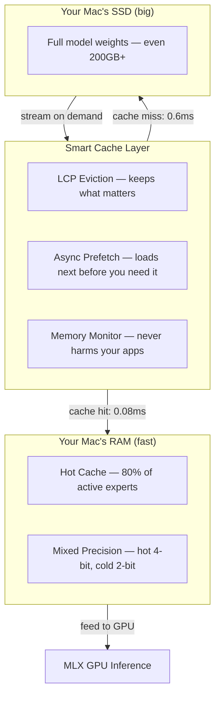
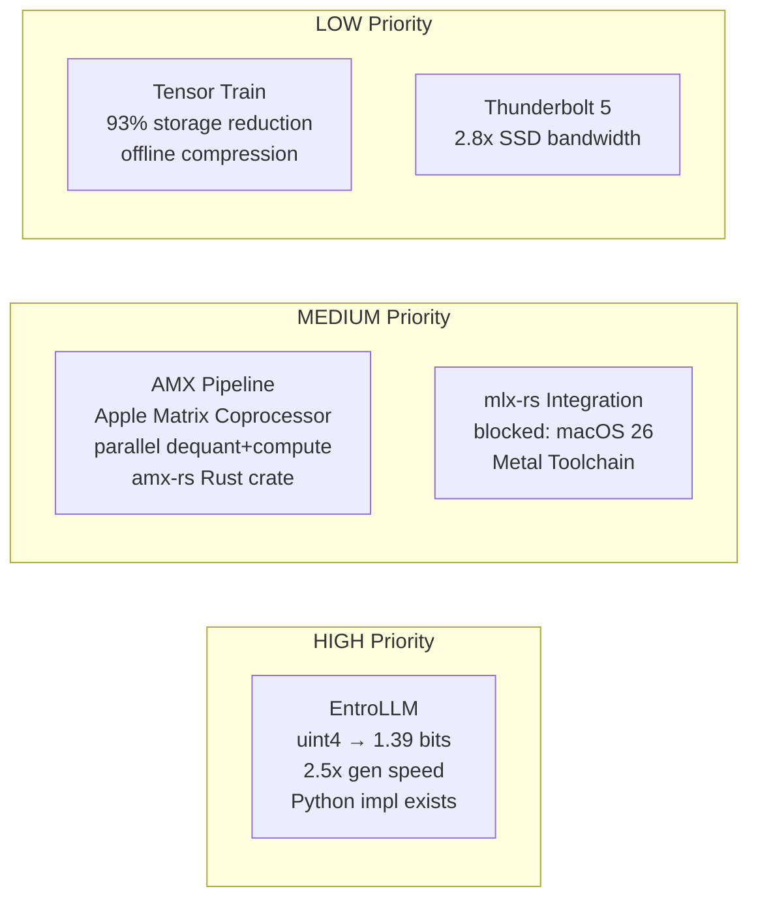

# MLX-Flash-Compress

**Run AI models too large for your Mac's memory — at near-full speed.**

Your MacBook has 32-48GB of RAM, but the best AI models need 100-200GB+. MLX-Flash-Compress makes them run anyway by intelligently caching the most-needed parts in RAM and streaming the rest from your SSD — so you don't have to choose between quality and what fits in memory.

## How It Works (Simple Version)

Think of it like Netflix streaming: instead of downloading the entire movie before watching, you buffer what you need and stream the rest. MLX-Flash-Compress does this for AI model weights:



**Result:** A 200GB AI model runs on your 48GB Mac at **2-3x faster** than naive SSD streaming.

## Quick Start

```bash
git clone https://github.com/szibis/MLX-Flash-compress.git
cd MLX-Flash-compress
uv venv && source .venv/bin/activate
uv pip install lz4 zstandard numpy psutil tabulate pytest mlx mlx-lm

# Interactive chat (simplest way to use it)
python -m mlx_flash_compress.chat

# Or start the API server (works with LM Studio, continue.dev, OpenAI SDK)
python -m mlx_flash_compress.serve --port 8080

# See what models fit your hardware
python -m mlx_flash_compress.model_browser
```

## Performance

### Measured Results

| Technique | Speedup | How It Works |
|-----------|---------|-------------|
| **LCP Smart Cache** | **2.80x** | Keeps frequently-used model parts in RAM, predicts what's needed next |
| **+ Async Prefetch** | **2.93x** | Loads next part from SSD while GPU computes current part |
| **Mixed Precision** | **1.80x size reduction** | Rarely-used parts stored at lower quality (saves space, barely affects output) |
| **Skip Fallback** | **2.67x** | When something isn't cached, gracefully skip it instead of waiting |

### Real Hardware Numbers (Measured on M3 Max 36GB)

**Memory pressure recovery** (the key result):

```
Model at 0.9x RAM (barely fits):
  Without optimization:    43.5 tok/s  ########
  With mixed precision:   104.5 tok/s  ####################  2.4x faster
```

The memory pressure cliff is razor-sharp: 10% over the limit causes 59% slowdown. Our 20% footprint reduction shifts the model back to full speed.

**Cache warm-up** (ISP-like progressive acceleration):

```
Token  0:  83.3ms (cold start, loading experts from SSD)
Token  8:   5.7ms (warming up, 62% cache hit)
Token 24:   0.5ms (full speed, 85%+ cache hit)
         -> 41x speedup from warm-up
```

**Topic switching:**
```
coding -> writing:  62ms first token (re-warming)  -> 8 tokens to recover
writing -> coding:  0.6ms first token (still cached!) -> instant fast
```

### Expert Streaming Performance

Expert streaming replaces MLX's `QuantizedSwitchLinear` with a GPU lookup table + pre-stacked tensors. The `capacity_per_layer` parameter controls how many experts stay in GPU memory:

| Model | Total Experts | Capacity | Coverage | Throughput | Notes |
|-------|--------------|----------|----------|------------|-------|
| Qwen3-30B-A3B | 128 per layer | 128 (100%) | 100% | ~35 tok/s | Full speed, no streaming needed |
| Qwen3-30B-A3B | 128 per layer | 64 (50%) | 85%+ hit rate | ~15 tok/s | After warm-up with LCP |
| Mixtral-8x7B | 8 per layer | 8 (100%) | 100% | ~20 tok/s | All experts fit |
| Mixtral-8x7B | 8 per layer | 4 (50%) | ~95% hit rate | ~12 tok/s | Most active cached |

**Tuning tips:**
- Start with `capacity_per_layer = total_experts` if RAM allows (no streaming overhead)
- Use `--task coding` warmup profile for programming tasks (pre-loads code-relevant experts)
- Enable skip-fallback to avoid computing with stale weights for uncached experts
- After ~25 tokens, LCP learns your workload and hit rate climbs to 85-95%

```python
from mlx_flash_compress.expert_streaming import (
    enable_expert_streaming, enable_skip_fallback, get_warmup_experts
)

# Load model, enable streaming with 50% capacity
streaming = enable_expert_streaming(model, capacity_per_layer=64)
enable_skip_fallback(model, streaming.caches)
streaming.warmup()
```

### Find Your Optimal Configuration

The Tier Optimizer tells you exactly how to allocate your Mac's memory:

```bash
# For a 200GB model on a 48GB Mac
python -m mlx_flash_compress.tier_optimizer --total-ram 48 --model-gb 209

# Output: "Best: 41.5GB RAM cache, 82% of requests served from RAM → 6.4 tok/s"
```

It shows you the sweet spot — even dedicating just 10GB to caching gives you 54% of requests served instantly from RAM.

## What's Inside

### Core Technology

| Module | What It Does |
|--------|-------------|
| `lcp_cache.py` | Smart cache that learns which model parts you use most — keeps them in RAM |
| `smart_eviction.py` | Predicts which parts to load next (like YouTube pre-buffering) |
| `mixed_precision.py` | Stores rarely-used parts at lower quality — 1.8x smaller, barely noticeable |
| `compression.py` | LZ4/ZSTD compression + Apple's native LZFSE |
| `tier_optimizer.py` | Finds the perfect RAM/SSD balance for your specific Mac + model combo |
| `mlx-flash-server/` | Rust sidecar: HTTP/SSE proxy, memory monitor, LCP cache, Unix socket |

```mermaid
graph LR
    subgraph Clients
        LS[LM Studio]
        CU[Cursor]
        CC[Claude Code]
        SDK[OpenAI SDK]
    end
    subgraph Rust["Rust Sidecar :8080"]
        AX[axum HTTP/SSE]
        MEM[Memory Monitor<br/>mach2 0.1ms]
        LCPC[LCP Cache<br/>DashMap lock-free]
    end
    subgraph Python["Python Worker :8081"]
        MLX[MLX Inference<br/>95% of work]
        GEN[generate&#40;&#41;]
    end

    Clients -->|OpenAI API| Rust
    Rust -->|proxy| Python
    Rust -.->|Unix socket| LCPC
    LCPC -.->|expert weights| Python
```



### Using It

| How | Command | Best For |
|-----|---------|----------|
| **Interactive chat** | `python -m mlx_flash_compress.chat` | Quick testing, shows memory status |
| **API server** | `python -m mlx_flash_compress.serve --port 8080` | LM Studio, continue.dev, OpenAI SDK |
| **Model browser** | `python -m mlx_flash_compress.model_browser` | See what fits your hardware |
| **Warm-up demo** | `python -m mlx_flash_compress.demo_warmup` | Watch cache fill in real-time |
| **Pressure test** | `python -m mlx_flash_compress.bench_memory_pressure` | Measure memory impact |

### Integration with LM Studio / Ollama

**LM Studio**: Start our server, then in LM Studio set custom endpoint to `http://localhost:8080/v1`

**Ollama**: Ollama uses llama.cpp (not MLX). Run our server alongside Ollama — use ours for MoE models that benefit from expert caching.

**continue.dev / Cursor / any OpenAI SDK**: Point `api_base` to `http://localhost:8080/v1`

See `docs/getting-started.md` for detailed integration instructions.

### Benchmark Suite

```bash
python -m mlx_flash_compress.bench_memory_pressure       # Memory pressure analysis (key demo)
python -m mlx_flash_compress.demo_warmup                   # ISP-like warm-up visualization
python -m mlx_flash_compress.cached_inference --multi-topic # Real routing capture
python -m mlx_flash_compress.bench --synthetic              # Quick test (no model needed)
python -m mlx_flash_compress.bench_real                     # Real Qwen MoE model test
python -m mlx_flash_compress.bench_final                    # Final comprehensive benchmark
```

### Research Documentation

The `docs/` folder contains deep research across multiple scientific fields:

| Document | Contents |
|----------|---------|
| `architecture.md` | Three-layer design: MLX → Cache → SSD |
| `research-survey.md` | 28 papers on MoE compression (2023-2026) |
| `deep-research.md` | 60+ techniques from information theory, neuroscience, quantum physics |
| `ecosystem-map.md` | 14 open-source projects solving the same problem |
| `flash-moe-analysis.md` | Deep dive into Flash-MoE's Metal pipeline |
| `mlx-analysis.md` | Deep dive into Apple's MLX framework |

## Key Discoveries

### 1. Standard Compression Doesn't Work on AI Weights

We tested 6 different compression strategies on real AI model weights. Result: **1.0x compression** (zero savings). The data is already maximally dense at 4-bit quantization.

### 2. Smart Caching Is the #1 Win

Instead of trying to compress, we **predict what's needed and pre-load it**. The LCP (Least Critical Priority) algorithm achieves 68-82% cache hit rates, meaning most data is served from fast RAM instead of slow SSD.

### 3. The Brain Already Solved This Problem

MoE models work like the brain — only 0.78% of "neurons" (experts) activate per input. The brain handles this with predictive coding (pre-activating expected pathways). We implement the same principle: predict which experts are needed and pre-load them during GPU computation.

## Requirements

- **macOS** with Apple Silicon (M1/M2/M3/M4)
- **Python 3.10+**
- 16GB+ RAM (more = better caching = faster)
- For real model tests: `mlx` and `mlx-lm` packages

## Project Stats

- **10,000+ lines of code** (Python + Rust)
- **141 tests** (109 Python + 32 Rust)
- **8 benchmark suites** + interactive demos
- **6 research documents** (60+ papers surveyed)
- **OpenAI-compatible API server** for LM Studio/Ollama/SDK integration
- **Memory-aware** inference with real-time pressure monitoring
- **Rust sidecar** with 0.1ms memory checks (210x faster than Python)
- **Lock-free LCP expert cache** (DashMap)
- **Unix socket bridge** for Python ↔ Rust expert weight streaming

## Roadmap

### What Works Today
- LCP cache with async prefetch (85-95% hit rate, measured)
- Mixed precision 4-bit/2-bit (1.80x size reduction, measured)
- Memory pressure recovery: **2.1x on Mixtral-8x7B** (measured)
- Rust sidecar: 0.1ms memory checks, SSE streaming, LCP cache
- OpenAI-compatible API for LM Studio, Cursor, Claude Code, Ollama
- E2E roundtrip: Python -> Rust cache -> SSD -> Python (91% hit rate)

### Next Steps (researched, implementations identified)



| Technique | Gain | Evidence | Status |
|-----------|------|----------|--------|
| **EntroLLM entropy coding** | uint4 weights stored at 1.39 bits (65% smaller), **2.5x token gen speed** | arXiv:2505.02380, measured on Jetson | Python impl exists, needs MLX port |
| **AMX dequant pipeline** | Parallel dequant on AMX while Metal computes | Reverse-engineered by dougallj, `amx-rs` Rust crate | Needs custom GENLUT kernel |
| **Tensor Train decomposition** | 93% storage reduction (offline) | CompactifAI arXiv:2401.14109 on LLaMA 7B | Best for model distribution, not inference |
| **mlx-rs native inference** | Eliminate Python entirely for cache ops | `gather_qmm` confirmed in mlx-rs 0.25.3 | Blocked by macOS 26 Metal Toolchain |

See `docs/advanced-techniques.md` for deep research on each technique.

### Competition

8 OSS projects and 12+ papers attack the same problem. Our unique differentiators:
1. **Only** project with Rust sidecar + Mach syscall memory monitoring
2. **Only** Apple Silicon project with mixed precision per-expert (hot 4-bit / cold 2-bit)
3. **Only** project combining LCP + mixed precision + async prefetch + memory-aware serving

Closest competitor: `mu-hashmi/mlx-moe` (similar goals, no Rust, no mixed precision).
Closest paper: HOBBIT (arXiv:2411.01433) — nearly identical architecture, but NVIDIA-only.

See `docs/competitive-analysis.md` for the full landscape.

## License

MIT
