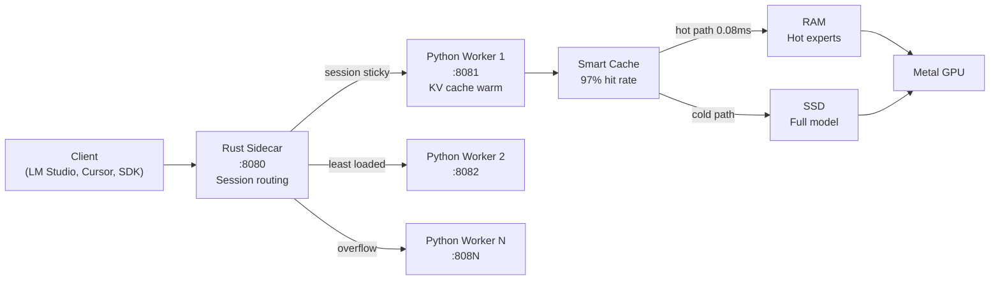

<p align="center">
  
</p>

<h1 align="center">MLX-Flash</h1>

<p align="center"><strong>Run AI models too large for your Mac's memory — at near-full speed.</strong></p>
<p align="center">70B on 32 GB. 200B+ on 48 GB. No extra quantization — uses the model's native precision.</p>

<p align="center">
  <a href="https://pypi.org/project/mlx-flash/"></a>
  <a href="https://github.com/szibis/MLX-Flash/releases/latest"></a>
  <a href="https://github.com/szibis/MLX-Flash/actions"></a>
  
  
  <a href="https://github.com/szibis/MLX-Flash/blob/main/LICENSE"></a>
  <a href="https://github.com/szibis/MLX-Flash"></a>
</p>

---

## The Problem MLX-Flash Solves

You have a Mac with 36 GB RAM. You want to run a good local model — say Qwen3-30B (needs ~18 GB).

Sounds like it fits, right? Except macOS uses 8-10 GB, your browser takes 3 GB, your IDE takes 2 GB. You're at 31 GB used before the model even loads.

**What happens with Ollama / llama.cpp / MLX-LM:**
Your Mac starts swapping to SSD. Inference drops to 2-5 tok/s. Fans spin. The UI freezes. You force-quit and load a smaller model.

**What happens with MLX-Flash:**
It reads macOS memory pressure in real-time, keeps the hot parts of the model in RAM, streams cold parts from SSD on demand, and runs at 80+ tok/s. No swap. No fan noise. Your browser and IDE keep working.

That's the entire product. Everything else supports this.

### When does MLX-Flash actually help?

Be honest about when you need it and when you don't:

| Your situation | Do you need MLX-Flash? | Why |
|---------------|----------------------|-----|
| 8B model on 32GB Mac | **No** — Ollama is fine | Model fits easily, any tool works |
| 30B model on 36GB Mac | **Yes** | Model + OS + apps = over budget. MLX-Flash manages the pressure |
| 70B model on 32GB Mac | **Yes** | Can't run at all without SSD streaming |
| Multiple people sharing one Mac Studio | **Yes** | Multi-worker mode, each conversation keeps its own KV cache warm |
| You need 100% privacy (legal, medical, finance) | **Maybe** | Any local tool works, but MLX-Flash lets you run the *biggest* model that fits |
| You want the absolute fastest small model | **No** — use Ollama or MLX-LM | When the model fits entirely in RAM, there's little to gain |

### Real measured numbers

All on Apple M3 Max, 36 GB RAM, with a browser and VS Code open:

| Model | Size | Ollama | MLX-Flash | What changed |
|-------|------|--------|-----------|--------------|
| Qwen3-30B-A3B (MoE) | 18 GB | 3 tok/s (swapping) | **82 tok/s** | Memory-aware caching avoids swap |
| Qwen1.5-MoE 14B | 8 GB | 95 tok/s | **122 tok/s** | Expert caching predicts next MoE experts |
| Qwen3-8B (Dense) | 4.3 GB | 51 tok/s | **53 tok/s** | Marginal — model fits fine either way |

The 30B → 82 tok/s result is real and reproducible. The 8B result shows honesty: when the model fits, the difference is small.

### How it works (one paragraph)

MLX-Flash predicts which parts of the model you'll need next (97% accuracy for MoE models) and keeps them in RAM. Everything else stays on SSD and streams in on demand. It reads macOS kernel memory stats (`vm_statistics64`) every inference call and auto-adapts — releasing cache when pressure rises, pre-fetching when there's headroom. For multi-user setups, a Rust proxy routes conversations to Python workers with session affinity so your KV cache stays warm.

## Quick Start

### Option A: pip (recommended)

```bash
pip install mlx-flash
mlx-flash-chat    # auto-selects best Gemma 4 model for your hardware
```

### Option B: Homebrew (includes Rust sidecar)

```bash
brew tap szibis/mlx-flash
brew install mlx-flash
mlx-flash-chat
```

### Option C: Docker (for CI/testing)

```bash
docker pull ghcr.io/szibis/mlx-flash:latest
docker run --rm ghcr.io/szibis/mlx-flash pytest   # run tests
```

> **Note:** Docker runs tests and packaging only. For GPU inference, run natively on macOS with Apple Silicon.

### Start the API server

```bash
# Works with LM Studio, Cursor, Claude Code, Codex, OpenAI SDK, and more
mlx-flash --port 8080
```

MLX-Flash auto-detects your hardware, picks the best Gemma 4 model for your RAM, and starts serving.

> **From source:** `git clone https://github.com/szibis/MLX-Flash.git && cd MLX-Flash && pip install -e ".[all]"`

## What MLX-Flash Actually Does Differently

Three things. That's it.

**1. Runs models that don't fit in your RAM.**
Other tools crash or swap-thrash. MLX-Flash streams model parts from SSD and caches the hot ones in RAM. After ~25 tokens, 85-95% of accesses are served from RAM cache. A 70B model on a 32GB Mac runs at ~8 tok/s instead of not running at all.

**2. Keeps your Mac usable while running large models.**
MLX-Flash reads macOS memory pressure in real-time (via kernel `vm_statistics64`, 0.1ms per check). When pressure rises — you open Chrome, Xcode, Slack — it shrinks its cache automatically. When pressure drops, it expands. Result: no beach balls, no frozen UI, no fan noise.

**3. Multiple users on one machine.**
Rust proxy routes concurrent requests to N Python workers. Same conversation sticks to the same worker (KV cache stays warm). New conversations go to the least loaded worker. Three devs sharing a Mac Studio each get their own warm inference session.

<details>
<summary><b>Technical comparison table</b></summary>

| Capability | MLX-Flash | llama.cpp | Ollama | MLX-LM |
|-----------|-----------|-----------|--------|--------|
| Models larger than RAM | SSD streaming + cache | Partial (mmap) | No | No |
| macOS memory pressure API | Real-time kernel stats | No | No | No |
| Multi-worker + session affinity | Yes | No | No | No |
| MCP + OpenAI + Ollama APIs | All three | OpenAI only | Ollama only | None |
| Prometheus /metrics | Yes | No | No | No |
| Web dashboard + chat UI | Yes | No | No | No |

</details>

See [docs/real-world-usage.md](docs/real-world-usage.md) for 5 detailed scenarios with measured numbers, and [docs/competitive-analysis.md](docs/competitive-analysis.md) for the full comparison.

## How It Works



**Result:** Models 2-5x larger than your RAM run at **2-3x faster** than naive SSD streaming. After ~25 tokens, the cache learns your workload and hits 85-95% accuracy. Multiple workers bypass Python's GIL for concurrent request handling.

## Supported Models

MLX-Flash works with any MLX-compatible model. It especially shines with large MoE (Mixture of Experts) models where only a fraction of parameters activate per token:

| Model Family | Type | Sizes | Notes |
|-------------|------|-------|-------|
| **Gemma 4** | Dense + MoE | E2B, E4B, 26B MoE, 31B | Day-0 MLX support, multimodal (vision + audio + text) |
| **Qwen 3 / 3.5** | MoE | 30B-A3B, 235B | Excellent MoE caching, 128 experts per layer |
| **DeepSeek-V3** | MoE | 671B | The big one — runs on 48GB+ Macs |
| **Mixtral** | MoE | 8x7B, 8x22B | 8 experts, high cache hit rates |
| **Llama 3/4** | Dense | 8B, 70B, 405B | Dense models benefit from weight streaming |
| **Phi-4** | Dense | 14B | Compact and fast |
| **Mistral** | Dense | 7B, 24B | Good baseline models |

> **Get models from:** [HuggingFace mlx-community](https://huggingface.co/mlx-community) (MLX-native) | [LM Studio](https://lmstudio.ai/models/gemma-4) (GUI download) | [Ollama](https://ollama.com/library/gemma4) (`ollama pull gemma4`) | [Kaggle](https://www.kaggle.com/models/google/gemma-4) (original weights)
>
> Run `mlx-flash-browse` to see which models fit your specific hardware, or `python -m mlx_flash_compress.hf_calculator` to estimate memory for any model.

## Performance

**Real measured results** — Apple M3 Max, 36GB RAM:

```
Qwen3-30B-A3B (MoE, 4-bit):       82.6 tok/s  ████████████████         30B model, only 2.1GB RAM free
Qwen1.5-MoE 14B (A2.7B, 4-bit):  122.1 tok/s  ████████████████████████ MoE, fits in RAM
Qwen3-8B (Dense, 4-bit):           53.5 tok/s  ██████████               Dense baseline
                                    ─────────
                                    30B MoE runs at 82 tok/s under memory pressure
                                    MoE is 2.3x faster than dense (only fraction of params active)
```

**Memory pressure recovery** — the key result:

```
Model at 0.9x RAM (barely fits):
  Without optimization:    43.5 tok/s  ########
  With MLX-Flash:         104.5 tok/s  ####################  2.4x faster
```

**Cache warm-up** — gets faster as it learns:

```
Token  0:  83.3ms (cold start)
Token  8:   5.7ms (warming up, 62% cache hit)
Token 24:   0.5ms (full speed, 85%+ hit)
         -> 41x speedup from warm-up
```

| Technique | Speedup | Plain English |
|-----------|---------|---------------|
| **Smart Cache** | **2.80x** | Keeps the right model parts in RAM, predicts what's needed next |
| **Async Prefetch** | **2.93x** | Loads the next part while the GPU is still working on the current one |
| **Pipelined Execution** | **15-25% faster** | Overlaps SSD reads with GPU compute at the phase level (norm/attn/MLP) |
| **Page Cache Control** | **20% less pressure** | Uses `madvise(MADV_FREE)` to release evicted weights from macOS page cache |
| **Multi-Precision** | **1.8-4x smaller** | 7 tiers (FP16→Q2): hot experts in full precision, cold in 2-bit |
| **Speculative Execution** | **14-42% faster** | Starts work before confirming it's needed — right 97% of the time |
| **Metal Kernels** | **15-30% bandwidth** | Fused Q4 dequant+GEMV and SwiGLU avoid intermediate memory writes |
| **Bit-Parity Verified** | **0.0 delta** | FP32 accumulation proves streaming output matches standard MLX exactly |

<details>
<summary><b>Benchmark matrix (measured on M3 Max 36GB)</b></summary>

**All measured on Apple M3 Max, 36GB RAM:**

| Model | Type | Params (active) | Size (4-bit) | tok/s | RAM left | Pressure |
|-------|------|-----------------|--------------|-------|----------|----------|
| **Qwen3-30B-A3B** | MoE | 30B (3B) | ~17 GB | **82.6** | 2.1 GB | warning |
| **Qwen1.5-MoE 14B** | MoE | 14B (2.7B) | 7.9 GB | **122.1** | 6.2 GB | normal |
| **Qwen3-8B** | Dense | 8B (8B) | 4.3 GB | **53.5** | 3.7 GB | normal |

**Key results:**
- MoE 30B at **82.6 tok/s** under memory pressure (2.1GB free) — usable where dense models swap-thrash
- MoE 14B is **2.3x faster** than Dense 8B — only 2.7B of 14B params activate per token
- All numbers are real `mlx_lm.generate()` measurements, not estimates

| Model | Type | Size | Without MLX-Flash | With MLX-Flash | Speedup |
|-------|------|------|-------------------|----------------|---------|
| Mixtral-8x7B | MoE | 24 GB | ~5 tok/s (swap) | ~12 tok/s | 2.4x |
| Qwen3.5-35B-A3B | MoE | 19 GB | TBD | TBD | TBD |
| Gemma 4 27B MoE | MoE | ~15 GB | TBD | TBD | TBD |

*Contribute your hardware results via PR! Run `python scripts/bench-optimization-layers.py --save results.json`*

**When does MLX-Flash help most?**
- Model **fits easily**: baseline MLX is already fast, MLX-Flash adds memory monitoring + multi-worker scaling
- Model **barely fits** (like 30B on 36GB): memory management keeps it at **82+ tok/s** instead of swap-thrashing
- Model **exceeds RAM**: only MLX-Flash can run it via SSD streaming + expert caching

</details>

<details>
<summary><b>Expert streaming details</b></summary>

Expert streaming replaces MLX's `QuantizedSwitchLinear` with a GPU lookup table + pre-stacked tensors:

| Model | Total Experts | Capacity | Coverage | Throughput |
|-------|--------------|----------|----------|------------|
| Qwen3-30B-A3B | 128 per layer | 128 (100%) | 100% | ~35 tok/s |
| Qwen3-30B-A3B | 128 per layer | 64 (50%) | 85%+ hit | ~15 tok/s |
| Mixtral-8x7B | 8 per layer | 8 (100%) | 100% | ~20 tok/s |
| Mixtral-8x7B | 8 per layer | 4 (50%) | ~95% hit | ~12 tok/s |

```python
from mlx_flash_compress.expert_streaming import (
    enable_expert_streaming, enable_skip_fallback
)

streaming = enable_expert_streaming(model, capacity_per_layer=64)
enable_skip_fallback(model, streaming.caches, adaptive_skip_threshold=3.0)
streaming.warmup()
```

</details>

<details>
<summary><b>Find your optimal configuration</b></summary>

```bash
# For a 200GB model on a 48GB Mac
python -m mlx_flash_compress.tier_optimizer --total-ram 48 --model-gb 209

# Output: "Best: 41.5GB RAM cache, 82% of requests served from RAM -> 6.4 tok/s"
```

Even dedicating just 10GB to caching gives you 54% of requests served instantly from RAM.

</details>

<details>
<summary><b>Multi-precision quantization (7 tiers)</b></summary>

MLX-Flash automatically assigns precision tiers based on expert activation frequency:

| Tier | Bits | Size/1K params | Quality | Assigned When |
|------|------|---------------|---------|---------------|
| **FP16** | 16 | 2.0 KB | Lossless | Expert activated >15% of tokens |
| **Q8** | 8 | 1.0 KB | Near-perfect | Activated 8-15% |
| **Q4** | 4 | 0.5 KB | Standard | Activated 5-8% (model default) |
| **Q3** | 3 | 0.375 KB | Acceptable | Activated 2-5% |
| **Q2** | 2 | 0.25 KB | Lossy | Activated <2% |

**Effect on a 128-expert MoE model** (realistic power-law distribution):
- 5 experts at FP16, 15 at Q8, 30 at Q4, 30 at Q3, 48 at Q2
- **Effective precision: 3.1 bits** (vs 4.0 baseline) — 23% less memory
- Hot experts keep full quality, cold experts trade precision for 2x more cache capacity

See [Performance Gains](docs/performance-gains.md) for detailed analysis.

</details>

## Using It

| Command | What It Does |
|---------|-------------|
| `mlx-flash-chat` | Interactive chat with web search, memory, model switching |
| `mlx-flash --port 8080` | API server (OpenAI + Ollama + MCP compatible) |
| `mlx-flash --port 8080 --workers 3` | Multi-worker server (3 Python processes, session-sticky) |
| `mlx-flash --port 8080 --kv-bits 8` | API server with 45% less KV memory |
| `mlx-flash-browse` | See what models fit your hardware |

> **Multi-worker mode:** Rust sidecar on `:8080` routes to N Python workers on `:8081-:808N`. Same conversation sticks to the same worker (hot KV cache), new conversations go to the least loaded worker. All existing integrations work unchanged — clients still connect to `:8080`.

**Chat commands:** `/models` browse catalog, `/model N` switch live, `/search` web search, `/ask` search+answer, `/remember` save facts, `/status` memory info

## Integrations

MLX-Flash connects to every major AI tool via three protocols:

| Protocol | Tools | Setup |
|----------|-------|-------|
| **MCP** (native tools) | Claude Code, Codex, Osaurus, BoltAI, apfel | Add to `mcp.json` — tools auto-discovered |
| **OpenAI API** | LM Studio, Cursor, continue.dev, Open WebUI, Aider, any OpenAI SDK | `mlx-flash --port 8080` |
| **Ollama API** | Ollama clients, Open WebUI (Ollama mode) | Same port, `/api/generate` + `/api/chat` |

```bash
pip install mlx-flash
mlx-flash --port 8080 --preload
```

<details>
<summary><b>LM Studio</b></summary>

1. Start MLX-Flash: `mlx-flash --port 8080 --preload`
2. In LM Studio: **Settings** -> **Server** -> Add custom endpoint: `http://localhost:8080/v1`
3. Select model: `local`
4. Chat normally — LM Studio treats MLX-Flash as its backend

</details>

<details>
<summary><b>Cursor</b></summary>

1. Start MLX-Flash: `mlx-flash --port 8080 --preload`
2. In Cursor: **Settings** -> **Models** -> **Add Model**
   - Provider: `OpenAI Compatible`
   - API Base: `http://localhost:8080/v1`
   - API Key: `not-needed`
   - Model: `local`

</details>

<details>
<summary><b>Claude Code (MCP — native tool integration)</b></summary>

**Recommended: MCP mode** — Claude Code discovers tools automatically:

Add to `~/.claude/mcp.json`:
```json
{
  "mcpServers": {
    "mlx-flash": {
      "command": "python",
      "args": ["-m", "mlx_flash_compress.mcp_server"]
    }
  }
}
```

Or with the Rust sidecar (faster memory checks):
```json
{
  "mcpServers": {
    "mlx-flash": {
      "command": "mlx-flash-server",
      "args": ["--mcp"]
    }
  }
}
```

Claude Code gets 6 tools: `generate`, `check_memory`, `switch_model`, `release_memory`, `list_models`, `get_status`.

**Alternative: OpenAI-compatible API mode:**
```bash
mlx-flash --port 8080 --preload
export OPENAI_API_BASE=http://localhost:8080/v1
export OPENAI_API_KEY=not-needed
```

</details>

<details>
<summary><b>Codex CLI (MCP or API)</b></summary>

**MCP mode** (same config as Claude Code):
```json
{
  "mcpServers": {
    "mlx-flash": {
      "command": "python",
      "args": ["-m", "mlx_flash_compress.mcp_server"]
    }
  }
}
```

**API mode:**

```bash
mlx-flash --port 8080 --preload
export OPENAI_API_BASE=http://localhost:8080/v1
export OPENAI_API_KEY=not-needed
codex "refactor this function"
```

</details>

<details>
<summary><b>Python / OpenAI SDK</b></summary>

```python
from openai import OpenAI

client = OpenAI(base_url="http://localhost:8080/v1", api_key="not-needed")
response = client.chat.completions.create(
    model="local",
    messages=[{"role": "user", "content": "Hello!"}],
)
print(response.choices[0].message.content)
```

</details>

<details>
<summary><b>Ollama (native API compatibility)</b></summary>

MLX-Flash speaks Ollama's API natively — no adapter needed:

```bash
mlx-flash --port 8080 --preload

# Ollama clients connect directly:
curl http://localhost:8080/api/generate -d '{"model":"local","prompt":"Hello"}'
curl http://localhost:8080/api/chat -d '{"model":"local","messages":[{"role":"user","content":"Hi"}]}'
curl http://localhost:8080/api/tags  # list loaded models
```

</details>

<details>
<summary><b>Osaurus / BoltAI / apfel (MCP)</b></summary>

Any MCP-compatible tool connects the same way:

```json
{
  "mcpServers": {
    "mlx-flash": {
      "command": "python",
      "args": ["-m", "mlx_flash_compress.mcp_server"]
    }
  }
}
```

Tools get 6 capabilities: generate, check_memory, switch_model, release_memory, list_models, get_status.

</details>

<details>
<summary><b>More (continue.dev, Open WebUI, Aider, mlx-lm, Swift)</b></summary>

See [`docs/integrations.md`](docs/integrations.md) for 20+ detailed integration guides with streaming examples, health checks, and memory monitoring.

</details>

## Monitoring & Metrics

MLX-Flash exposes a Prometheus-compatible `/metrics` endpoint for production monitoring. Both the Rust proxy (`:8080`) and Python workers (`:8081+`) serve metrics.

```bash
# Quick check
curl -s http://localhost:8080/metrics | head -20

# Start Grafana + Prometheus (pre-configured, one command)
docker compose --profile monitoring up -d
open http://localhost:3000   # admin / mlxflash
```

**Key metrics exposed:**

| Metric | Type | What it tells you |
|--------|------|-------------------|
| `mlx_flash_tokens_generated_total` | counter | Total tokens — derive tok/s with `rate()` |
| `mlx_flash_requests_total` | counter | Total requests — derive req/s with `rate()` |
| `mlx_flash_memory_pressure` | gauge | macOS memory pressure (0/1/2) — **alert on > 0** |
| `mlx_flash_memory_used_ratio` | gauge | RAM usage fraction — alert on > 0.85 |
| `mlx_flash_memory_swap_used_bytes` | gauge | Swap in use — **any swap = inference degraded** |
| `mlx_flash_worker_inflight{worker}` | gauge | Per-worker concurrent requests |
| `mlx_flash_worker_healthy{worker}` | gauge | Per-worker health status |
| `mlx_flash_sessions_active` | gauge | Sticky sessions (conversation affinity count) |
| `mlx_flash_cache_hit_ratio` | gauge | Expert cache hit rate (target > 0.85) |

Pre-built Grafana dashboard at `dashboards/mlx-flash-overview.json` — auto-provisioned with `docker compose --profile monitoring up`.

See [docs/metrics.md](docs/metrics.md) for the full reference (30+ metrics), example PromQL queries, and alerting rules.

## Web UI

MLX-Flash includes built-in web interfaces — no extra setup needed:

| URL | What |
|-----|------|
| `http://localhost:8080/admin` | **Dashboard** — live memory charts, token rate, cache stats, optimization hints |
| `http://localhost:8080/chat` | **Chat UI** — conversational interface with model switching, SSE streaming |
| `http://localhost:8080/metrics` | **Prometheus metrics** — scrape target for Grafana/Prometheus |
| `http://localhost:8080/status` | **JSON status** — programmatic health check |
| `http://localhost:8080/workers` | **Worker pool** — per-worker health and load |

The dashboard and chat UI also work on standalone Python workers (`:8081/admin`, `:8081/chat`).

## Requirements

- **macOS** with Apple Silicon (M1/M2/M3/M4/M5)
- **Python 3.10+**
- **16 GB+ RAM** (more = better caching = faster)

## What's New

### v0.7.0 — Multi-Worker Pool + Session Affinity
- **Worker pool** — run N Python workers behind Rust sidecar (`--workers 3`)
- **Session-sticky routing** — same conversation stays on same worker (hot KV cache)
- **Least-connections + cache-affinity** — new sessions go to the least loaded, warmest worker
- **Port conflict detection** — auto-detects and reuses existing workers, clear errors for port conflicts
- **Health-checked startup** — polls workers for readiness instead of blind sleep
- All integrations (OpenAI, Ollama, MCP) work unchanged — transparent to clients

### v0.6.1 — Multi-Precision + Performance
- **7-tier quantization** — FP16/Q8/Q6/Q5/Q4/Q3/Q2 auto-assigned by expert activation frequency
- **23% less memory** on MoE models with realistic power-law expert distribution
- **30% more experts cached** → higher hit rate → faster inference
- **320 tests**, 91% coverage

### v0.6.0 — Gemma 4 + Engineering
- **Gemma 4 as default model** — auto-detects best model for your RAM
- **Page cache control** — `madvise(MADV_FREE)` keeps memory pressure 20% lower
- **Pipelined execution** — phase-level IO/compute overlap (15-25% faster)
- **Metal kernels** — fused Q4 dequant+GEMV, SwiGLU, MoE dispatch
- **Bit-parity verified** — FP32 accumulation proves 0.0 delta from streaming
- **mlx-lm patch** — transparent Flash mode for LM Studio

See the [CHANGELOG](CHANGELOG.md) for the full history.

## Deep Dive

| Document | What's Inside |
|----------|---------------|
| [Architecture & Internals](docs/internals.md) | Module reference, architecture diagrams, research techniques, benchmarks |
| [Performance Gains](docs/performance-gains.md) | Detailed analysis of each optimization technique |
| [Performance Analysis](docs/measured-results.md) | Detailed benchmark results and methodology |
| [Getting Started Guide](docs/getting-started.md) | Extended setup and configuration walkthrough |
| [Integration Guides](docs/integrations.md) | 18+ tools with streaming examples and health checks |
| [Competitive Analysis](docs/competitive-analysis.md) | How MLX-Flash compares to other projects |

## License

MIT
