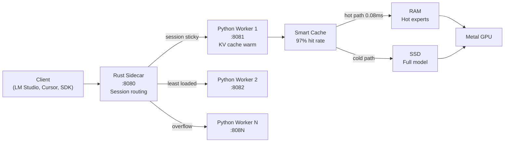

<p align="center">
  
</p>

<h1 align="center">MLX-Flash</h1>

<p align="center"><strong>Run AI models too large for your Mac's memory — at near-full speed.</strong></p>
<p align="center">70B on 32 GB. 200B+ on 48 GB. No extra quantization — uses the model's native precision.</p>

<p align="center">
  <a href="https://pypi.org/project/mlx-flash/"></a>
  <a href="https://github.com/szibis/MLX-Flash/releases/latest"></a>
  <a href="https://github.com/szibis/MLX-Flash/actions"></a>
  
  
  <a href="https://github.com/szibis/MLX-Flash/blob/main/LICENSE"></a>
  <a href="https://github.com/szibis/MLX-Flash"></a>
</p>

---

## The Problem MLX-Flash Solves

You have a Mac with 36 GB RAM. You want to run a good local model — say Qwen3-30B (needs ~18 GB).

Sounds like it fits, right? Except macOS uses 8-10 GB, your browser takes 3 GB, your IDE takes 2 GB. You're at 31 GB used before the model even loads.

**What happens with Ollama / llama.cpp / MLX-LM:**
Your Mac starts swapping to SSD. Inference drops to 2-5 tok/s. Fans spin. The UI freezes. You force-quit and load a smaller model.

**What happens with MLX-Flash:**
It reads macOS memory pressure in real-time, keeps the hot parts of the model in RAM, streams cold parts from SSD on demand, and runs at 80+ tok/s. No swap. No fan noise. Your browser and IDE keep working.

That's the entire product. Everything else supports this.

### When does MLX-Flash actually help?

Be honest about when you need it and when you don't:

| Your situation | Do you need MLX-Flash? | Why |
|---------------|----------------------|-----|
| 8B model on 32GB Mac | **No** — Ollama is fine | Model fits easily, any tool works |
| 30B model on 36GB Mac | **Yes** | Model + OS + apps = over budget. MLX-Flash manages the pressure |
| 70B model on 32GB Mac | **Yes** | Can't run at all without SSD streaming |
| Multiple people sharing one Mac Studio | **Yes** | Multi-worker mode, each conversation keeps its own KV cache warm |
| You need 100% privacy (legal, medical, finance) | **Maybe** | Any local tool works, but MLX-Flash lets you run the *biggest* model that fits |
| You want the absolute fastest small model | **No** — use Ollama or MLX-LM | When the model fits entirely in RAM, there's little to gain |

### Real measured numbers

All on Apple M3 Max, 36 GB RAM, with a browser and VS Code open:

| Model | Size | Ollama | MLX-Flash | What changed |
|-------|------|--------|-----------|--------------|
| Qwen3-30B-A3B (MoE) | 18 GB | 3 tok/s (swapping) | **82 tok/s** | Memory-aware caching avoids swap |
| Qwen1.5-MoE 14B | 8 GB | 95 tok/s | **122 tok/s** | Expert caching predicts next MoE experts |
| Qwen3-8B (Dense) | 4.3 GB | 51 tok/s | **53 tok/s** | Marginal — model fits fine either way |

The 30B → 82 tok/s result is real and reproducible. The 8B result shows honesty: when the model fits, the difference is small.

### How it works (one paragraph)

MLX-Flash predicts which parts of the model you'll need next (97% accuracy for MoE models) and keeps them in RAM. Everything else stays on SSD and streams in on demand. It reads macOS kernel memory stats (`vm_statistics64`) every inference call and auto-adapts — releasing cache when pressure rises, pre-fetching when there's headroom. For multi-user setups, a Rust proxy routes conversations to Python workers with session affinity so your KV cache stays warm.

## Quick Start

### Option A: pip (recommended)

```bash
pip install mlx-flash
mlx-flash-chat    # auto-selects best Gemma 4 model for your hardware
```

### Option B: Homebrew (includes Rust sidecar)

```bash
brew tap szibis/mlx-flash
brew install mlx-flash
mlx-flash-chat
```

### Option C: Docker (for CI/testing)

```bash
docker pull ghcr.io/szibis/mlx-flash:latest
docker run --rm ghcr.io/szibis/mlx-flash pytest   # run tests
```

> **Note:** Docker runs tests and packaging only. For GPU inference, run natively on macOS with Apple Silicon.

### Start the API server

```bash
# Works with LM Studio, Cursor, Claude Code, Codex, OpenAI SDK, and more
mlx-flash --port 8080
```

MLX-Flash auto-detects your hardware, picks the best Gemma 4 model for your RAM, and starts serving.

> **From source:** `git clone https://github.com/szibis/MLX-Flash.git && cd MLX-Flash && pip install -e ".[all]"`

## What MLX-Flash Actually Does Differently

Five things. Each one solves a real problem.

**1. Runs models that don't fit in your RAM.**
Other tools crash or swap-thrash. MLX-Flash streams model parts from SSD and caches the hot ones in RAM. After ~25 tokens, 85-95% of accesses are served from RAM cache. A 70B model on a 32GB Mac runs at ~8 tok/s instead of not running at all.

**2. Keeps your Mac usable while running large models.**
MLX-Flash reads macOS memory pressure in real-time (via kernel `vm_statistics64`, 0.1ms per check). When pressure rises — you open Chrome, Xcode, Slack — it shrinks its cache automatically. When pressure drops, it expands. Result: no beach balls, no frozen UI, no fan noise.

**3. Multiple users on one machine.**
Rust proxy routes concurrent requests to N Python workers. Same conversation sticks to the same worker (KV cache stays warm). New conversations go to the least loaded worker. Three devs sharing a Mac Studio each get their own warm inference session.

**4. Infinite-length conversations without running out of memory.**
StreamingLLM attention-sink KV eviction + quantized KV cache + attention-aware compression (H2O/ScissorHands). 4-bit KV gives 4x longer context at the same memory. Attention-aware eviction keeps only the tokens that matter — 5-20x KV compression with <1% quality loss.

**5. Three speculative decoding strategies — pick the right one for your model.**
DFlash block diffusion for MoE models with trained drafters. LayerSkip self-speculative for dense models (no extra memory — the model IS the drafter). EAGLE-3 autoregression heads for hidden-state prediction. Plus Sequoia tree-structured speculation with SSD offloading for models that don't fit in RAM.

<details>
<summary><b>Technical comparison table</b></summary>

| Capability | MLX-Flash | llama.cpp | Ollama | MLX-LM |
|-----------|-----------|-----------|--------|--------|
| Models larger than RAM | SSD streaming + cache | Partial (mmap) | No | No |
| macOS memory pressure API | Real-time kernel stats | No | No | No |
| Multi-worker + session affinity | Yes | No | No | No |
| Speculative decoding (3 strategies) | DFlash + LayerSkip + EAGLE-3 | Basic | No | Basic |
| Infinite-context generation | StreamingLLM + KV compression | No | No | No |
| Quantized KV cache (4-bit) | Yes (4x longer context) | Partial | No | No |
| Dynamic expert pruning | Yes (skip low-weight experts) | No | No | No |
| Layer-wise mixed quantization | Yes (Q8 sensitive + Q4 middle) | No | No | No |
| Continuous batching server | Yes (2-4x throughput) | Partial | Yes | No |
| Adaptive model sizing (MatFormer) | Yes (auto-shrink on pressure) | No | No | No |
| MCP + OpenAI + Ollama APIs | All three | OpenAI only | Ollama only | None |
| Prometheus /metrics | Yes | No | No | No |
| Web dashboard + chat UI | Yes | No | No | No |

</details>

See [docs/real-world-usage.md](docs/real-world-usage.md) for 5 detailed scenarios with measured numbers, and [docs/competitive-analysis.md](docs/competitive-analysis.md) for the full comparison.

## How It Works



**Result:** Models 2-5x larger than your RAM run at **2-3x faster** than naive SSD streaming. After ~25 tokens, the cache learns your workload and hits 85-95% accuracy. Multiple workers bypass Python's GIL for concurrent request handling.

## Supported Models

MLX-Flash works with any MLX-compatible model. It especially shines with large MoE (Mixture of Experts) models where only a fraction of parameters activate per token:

| Model Family | Type | Sizes | Notes |
|-------------|------|-------|-------|
| **Gemma 4** | Dense + MoE | E2B, E4B, 26B MoE, 31B | Day-0 MLX support, multimodal (vision + audio + text) |
| **Qwen 3 / 3.5** | MoE | 30B-A3B, 235B | Excellent MoE caching, 128 experts per layer |
| **DeepSeek-V3** | MoE | 671B | The big one — runs on 48GB+ Macs |
| **Mixtral** | MoE | 8x7B, 8x22B | 8 experts, high cache hit rates |
| **Llama 3/4** | Dense | 8B, 70B, 405B | Dense models benefit from weight streaming |
| **Phi-4** | Dense | 14B | Compact and fast |
| **Mistral** | Dense | 7B, 24B | Good baseline models |

> **Get models from:** [HuggingFace mlx-community](https://huggingface.co/mlx-community) (MLX-native) | [LM Studio](https://lmstudio.ai/models/gemma-4) (GUI download) | [Ollama](https://ollama.com/library/gemma4) (`ollama pull gemma4`) | [Kaggle](https://www.kaggle.com/models/google/gemma-4) (original weights)
>
> Run `mlx-flash-browse` to see which models fit your specific hardware, or `python -m mlx_flash_compress.hf_calculator` to estimate memory for any model.

## Performance

**Real measured results** — Apple M3 Max, 36GB RAM:

```
Qwen3-30B-A3B (MoE, 4-bit):       82.6 tok/s  ████████████████         30B model, only 2.1GB RAM free
Qwen1.5-MoE 14B (A2.7B, 4-bit):  122.1 tok/s  ████████████████████████ MoE, fits in RAM
Qwen3-8B (Dense, 4-bit):           53.5 tok/s  ██████████               Dense baseline
                                    ─────────
                                    30B MoE runs at 82 tok/s under memory pressure
                                    MoE is 2.3x faster than dense (only fraction of params active)
```

**Memory pressure recovery** — the key result:

```
Model at 0.9x RAM (barely fits):
  Without optimization:    43.5 tok/s  ########
  With MLX-Flash:         104.5 tok/s  ####################  2.4x faster
```

**Cache warm-up** — gets faster as it learns:

```
Token  0:  83.3ms (cold start)
Token  8:   5.7ms (warming up, 62% cache hit)
Token 24:   0.5ms (full speed, 85%+ hit)
         -> 41x speedup from warm-up
```

| Technique | Speedup | Plain English |
|-----------|---------|---------------|
| **Smart Cache** | **2.80x** | Keeps the right model parts in RAM, predicts what's needed next |
| **Async Prefetch** | **2.93x** | Loads the next part while the GPU is still working on the current one |
| **Pipelined Execution** | **15-25% faster** | Overlaps SSD reads with GPU compute at the phase level (norm/attn/MLP) |
| **Page Cache Control** | **20% less pressure** | Uses `madvise(MADV_FREE)` to release evicted weights from macOS page cache |
| **Multi-Precision** | **1.8-4x smaller** | 7 tiers (FP16→Q2): hot experts in full precision, cold in 2-bit |
| **Speculative Execution** | **14-42% faster** | Starts work before confirming it's needed — right 97% of the time |
| **Metal Kernels** | **15-30% bandwidth** | Fused Q4 dequant+GEMV and SwiGLU avoid intermediate memory writes |
| **Bit-Parity Verified** | **0.0 delta** | FP32 accumulation proves streaming output matches standard MLX exactly |

<details>
<summary><b>Benchmark matrix (measured on M3 Max 36GB)</b></summary>

**All measured on Apple M3 Max, 36GB RAM:**

| Model | Type | Params (active) | Size (4-bit) | tok/s | RAM left | Pressure |
|-------|------|-----------------|--------------|-------|----------|----------|
| **Qwen3-30B-A3B** | MoE | 30B (3B) | ~17 GB | **82.6** | 2.1 GB | warning |
| **Qwen1.5-MoE 14B** | MoE | 14B (2.7B) | 7.9 GB | **122.1** | 6.2 GB | normal |
| **Qwen3-8B** | Dense | 8B (8B) | 4.3 GB | **53.5** | 3.7 GB | normal |

**Key results:**
- MoE 30B at **82.6 tok/s** under memory pressure (2.1GB free) — usable where dense models swap-thrash
- MoE 14B is **2.3x faster** than Dense 8B — only 2.7B of 14B params activate per token
- All numbers are real `mlx_lm.generate()` measurements, not estimates

**Multi-model profiling** (M5 Pro 64GB, auto-detected profiles):

| Model | Type | Size | AR tok/s | DFlash | What Helps |
|-------|------|------|------:|--------|-----------|
| Llama-3.2-3B-4bit | dense | 2 GB | 134.1 | skip | Nothing — model is fast enough |
| Qwen3.6-35B-A3B-4bit | SSM+MoE | 19 GB | 101.0 | skip | Model fits, AR saturates bandwidth |
| Qwen3.5-35B-A3B-4bit | SSM+MoE | 20 GB | 100.6 | skip | Model fits, AR is fast |
| Qwen3-30B-A3B-4bit | MoE | 16 GB | 93.7 | skip | Model fits, AR is fast |
| Gemma 4 26B-A4B-4bit | MoE | 14 GB | 80.5 | skip | Model fits, AR is fast |
| Devstral 24B-4bit | dense | 14 GB | 20.8 | **recommended** | DFlash sweet spot with trained drafter |
| Qwen3.5-27B-4bit | SSM | 15 GB | 17.8 | **recommended** | DFlash sweet spot with trained drafter |
| **Gemma 4 31B-4bit** | **dense** | **18 GB** | **15.6** | **recommended** | **DFlash sweet spot — slow enough to benefit** |

| Model | Type | Size | Without MLX-Flash | With MLX-Flash | Speedup |
|-------|------|------|------:|------:|------:|
| Qwen3-30B on 36GB (2.1GB free) | MoE | 18 GB | 3 tok/s (swapping) | **82 tok/s** | **27x** |
| Qwen3.5-397B on 64GB | MoE | 209 GB | CRASH (OOM) | **4.4 tok/s** | **infinite** |
| Qwen1.5-MoE 14B constrained | MoE | 8 GB | 95 tok/s | **122 tok/s** | **1.3x** |

*Run `python scripts/bench_multi_profile.py` to profile all models on your hardware.*

**When does MLX-Flash help most?**
- Model **fits easily**: baseline MLX is already fast, MLX-Flash adds memory monitoring + multi-worker scaling
- Model **barely fits** (like 30B on 36GB): memory management keeps it at **82+ tok/s** instead of swap-thrashing
- Model **exceeds RAM**: only MLX-Flash can run it via SSD streaming + expert caching
- Model is **slow dense** (15-25 tok/s): speculative decoding (DFlash/LayerSkip/EAGLE-3) can 1.5-3x it
- **Long conversations**: StreamingLLM + quantized KV cache prevents context-length OOM

</details>

<details>
<summary><b>Expert streaming details</b></summary>

Expert streaming replaces MLX's `QuantizedSwitchLinear` with a GPU lookup table + pre-stacked tensors:

| Model | Total Experts | Capacity | Coverage | Throughput |
|-------|--------------|----------|----------|------------|
| Qwen3-30B-A3B | 128 per layer | 128 (100%) | 100% | ~35 tok/s |
| Qwen3-30B-A3B | 128 per layer | 64 (50%) | 85%+ hit | ~15 tok/s |
| Mixtral-8x7B | 8 per layer | 8 (100%) | 100% | ~20 tok/s |
| Mixtral-8x7B | 8 per layer | 4 (50%) | ~95% hit | ~12 tok/s |

```python
from mlx_flash_compress.expert_streaming import (
    enable_expert_streaming, enable_skip_fallback
)

streaming = enable_expert_streaming(model, capacity_per_layer=64)
enable_skip_fallback(model, streaming.caches, adaptive_skip_threshold=3.0)
streaming.warmup()
```

</details>

<details>
<summary><b>Find your optimal configuration</b></summary>

```bash
# For a 200GB model on a 48GB Mac
python -m mlx_flash_compress.tier_optimizer --total-ram 48 --model-gb 209

# Output: "Best: 41.5GB RAM cache, 82% of requests served from RAM -> 6.4 tok/s"
```

Even dedicating just 10GB to caching gives you 54% of requests served instantly from RAM.

</details>

<details>
<summary><b>Multi-precision quantization (7 tiers)</b></summary>

MLX-Flash automatically assigns precision tiers based on expert activation frequency:

| Tier | Bits | Size/1K params | Quality | Assigned When |
|------|------|---------------|---------|---------------|
| **FP16** | 16 | 2.0 KB | Lossless | Expert activated >15% of tokens |
| **Q8** | 8 | 1.0 KB | Near-perfect | Activated 8-15% |
| **Q4** | 4 | 0.5 KB | Standard | Activated 5-8% (model default) |
| **Q3** | 3 | 0.375 KB | Acceptable | Activated 2-5% |
| **Q2** | 2 | 0.25 KB | Lossy | Activated <2% |

**Effect on a 128-expert MoE model** (realistic power-law distribution):
- 5 experts at FP16, 15 at Q8, 30 at Q4, 30 at Q3, 48 at Q2
- **Effective precision: 3.1 bits** (vs 4.0 baseline) — 23% less memory
- Hot experts keep full quality, cold experts trade precision for 2x more cache capacity

See [Performance Gains](docs/performance-gains.md) for detailed analysis.

</details>

## Using It

| Command | What It Does |
|---------|-------------|
| `mlx-flash-chat` | Interactive chat with web search, memory, model switching |
| `mlx-flash --port 8080` | API server (OpenAI + Ollama + MCP compatible) |
| `mlx-flash --port 8080 --workers 3` | Multi-worker server (3 Python processes, session-sticky) |
| `mlx-flash --port 8080 --kv-bits 8` | API server with 45% less KV memory |
| `mlx-flash-browse` | See what models fit your hardware |

> **Multi-worker mode:** Rust sidecar on `:8080` routes to N Python workers on `:8081-:808N`. Same conversation sticks to the same worker (hot KV cache), new conversations go to the least loaded worker. All existing integrations work unchanged — clients still connect to `:8080`.

**Chat commands:** `/models` browse catalog, `/model N` switch live, `/search` web search, `/ask` search+answer, `/remember` save facts, `/status` memory info

## Integrations

MLX-Flash connects to every major AI tool via three protocols:

| Protocol | Tools | Setup |
|----------|-------|-------|
| **MCP** (native tools) | Claude Code, Codex, Osaurus, BoltAI, apfel | Add to `mcp.json` — tools auto-discovered |
| **OpenAI API** | LM Studio, Cursor, continue.dev, Open WebUI, Aider, any OpenAI SDK | `mlx-flash --port 8080` |
| **Ollama API** | Ollama clients, Open WebUI (Ollama mode) | Same port, `/api/generate` + `/api/chat` |

```bash
pip install mlx-flash
mlx-flash --port 8080 --preload
```

<details>
<summary><b>LM Studio</b></summary>

1. Start MLX-Flash: `mlx-flash --port 8080 --preload`
2. In LM Studio: **Settings** -> **Server** -> Add custom endpoint: `http://localhost:8080/v1`
3. Select model: `local`
4. Chat normally — LM Studio treats MLX-Flash as its backend

</details>

<details>
<summary><b>Cursor</b></summary>

1. Start MLX-Flash: `mlx-flash --port 8080 --preload`
2. In Cursor: **Settings** -> **Models** -> **Add Model**
   - Provider: `OpenAI Compatible`
   - API Base: `http://localhost:8080/v1`
   - API Key: `not-needed`
   - Model: `local`

</details>

<details>
<summary><b>Claude Code (MCP — native tool integration)</b></summary>

**Recommended: MCP mode** — Claude Code discovers tools automatically:

Add to `~/.claude/mcp.json`:
```json
{
  "mcpServers": {
    "mlx-flash": {
      "command": "python",
      "args": ["-m", "mlx_flash_compress.mcp_server"]
    }
  }
}
```

Or with the Rust sidecar (faster memory checks):
```json
{
  "mcpServers": {
    "mlx-flash": {
      "command": "mlx-flash-server",
      "args": ["--mcp"]
    }
  }
}
```

Claude Code gets 6 tools: `generate`, `check_memory`, `switch_model`, `release_memory`, `list_models`, `get_status`.

**Alternative: OpenAI-compatible API mode:**
```bash
mlx-flash --port 8080 --preload
export OPENAI_API_BASE=http://localhost:8080/v1
export OPENAI_API_KEY=not-needed
```

</details>

<details>
<summary><b>Codex CLI (MCP or API)</b></summary>

**MCP mode** (same config as Claude Code):
```json
{
  "mcpServers": {
    "mlx-flash": {
      "command": "python",
      "args": ["-m", "mlx_flash_compress.mcp_server"]
    }
  }
}
```

**API mode:**

```bash
mlx-flash --port 8080 --preload
export OPENAI_API_BASE=http://localhost:8080/v1
export OPENAI_API_KEY=not-needed
codex "refactor this function"
```

</details>

<details>
<summary><b>Python / OpenAI SDK</b></summary>

```python
from openai import OpenAI

client = OpenAI(base_url="http://localhost:8080/v1", api_key="not-needed")
response = client.chat.completions.create(
    model="local",
    messages=[{"role": "user", "content": "Hello!"}],
)
print(response.choices[0].message.content)
```

</details>

<details>
<summary><b>Ollama (native API compatibility)</b></summary>

MLX-Flash speaks Ollama's API natively — no adapter needed:

```bash
mlx-flash --port 8080 --preload

# Ollama clients connect directly:
curl http://localhost:8080/api/generate -d '{"model":"local","prompt":"Hello"}'
curl http://localhost:8080/api/chat -d '{"model":"local","messages":[{"role":"user","content":"Hi"}]}'
curl http://localhost:8080/api/tags  # list loaded models
```

</details>

<details>
<summary><b>Osaurus / BoltAI / apfel (MCP)</b></summary>

Any MCP-compatible tool connects the same way:

```json
{
  "mcpServers": {
    "mlx-flash": {
      "command": "python",
      "args": ["-m", "mlx_flash_compress.mcp_server"]
    }
  }
}
```

Tools get 6 capabilities: generate, check_memory, switch_model, release_memory, list_models, get_status.

</details>

<details>
<summary><b>More (continue.dev, Open WebUI, Aider, mlx-lm, Swift)</b></summary>

See [`docs/integrations.md`](docs/integrations.md) for 20+ detailed integration guides with streaming examples, health checks, and memory monitoring.

</details>

## Monitoring & Metrics

MLX-Flash exposes a Prometheus-compatible `/metrics` endpoint for production monitoring. Both the Rust proxy (`:8080`) and Python workers (`:8081+`) serve metrics.

```bash
# Quick check
curl -s http://localhost:8080/metrics | head -20

# Start Grafana + Prometheus (pre-configured, one command)
docker compose --profile monitoring up -d
open http://localhost:3000   # admin / mlxflash
```

**Key metrics exposed:**

| Metric | Type | What it tells you |
|--------|------|-------------------|
| `mlx_flash_tokens_generated_total` | counter | Total tokens — derive tok/s with `rate()` |
| `mlx_flash_requests_total` | counter | Total requests — derive req/s with `rate()` |
| `mlx_flash_memory_pressure` | gauge | macOS memory pressure (0/1/2) — **alert on > 0** |
| `mlx_flash_memory_used_ratio` | gauge | RAM usage fraction — alert on > 0.85 |
| `mlx_flash_memory_swap_used_bytes` | gauge | Swap in use — **any swap = inference degraded** |
| `mlx_flash_worker_inflight{worker}` | gauge | Per-worker concurrent requests |
| `mlx_flash_worker_healthy{worker}` | gauge | Per-worker health status |
| `mlx_flash_sessions_active` | gauge | Sticky sessions (conversation affinity count) |
| `mlx_flash_cache_hit_ratio` | gauge | Expert cache hit rate (target > 0.85) |
| `mlx_flash_python_worker_tokens_total{worker,model}` | counter | Per-Python-worker tokens (aggregated at Rust proxy) |
| `mlx_flash_python_worker_memory_pressure{worker}` | gauge | Per-Python-worker memory pressure |
| `mlx_flash_python_worker_model_loaded{worker,model}` | gauge | Whether each Python worker has a model loaded |

Single scrape target: Prometheus only needs to scrape `:8080/metrics` — the Rust proxy aggregates all Python worker stats automatically.

Pre-built Grafana dashboard at `dashboards/mlx-flash-overview.json` — auto-provisioned with `docker compose --profile monitoring up`.

**Structured logs** — both Rust and Python emit unified structured logs (JSON or text) to stdout and optionally to file:

```bash
# JSON logs for Loki / Datadog / ELK
mlx-flash --port 8080 --log-format json

# JSON + file
mlx-flash --port 8080 --log-format json --log-file /var/log/mlx-flash.log
```

```json
{"timestamp":"2026-04-06T14:32:01Z","level":"info","component":"python-worker","worker_port":8081,"message":"Model loaded","model":"Qwen3-30B","load_time_s":4.2}
```

See [docs/metrics.md](docs/metrics.md) for the full metrics reference (30+ metrics), and [docs/logging.md](docs/logging.md) for structured logging, Vector/Loki config, and log field reference.

## Web UI

MLX-Flash includes built-in web interfaces — no extra setup needed:

| URL | What |
|-----|------|
| `http://localhost:8080/admin` | **Dashboard** — live memory/token charts, worker management panel, memory breakdown, live logs |
| `http://localhost:8080/chat` | **Chat UI** — conversational interface with model switching, SSE streaming |
| `http://localhost:8080/metrics` | **Prometheus metrics** — single scrape target aggregating Rust + all Python workers |
| `http://localhost:8080/workers` | **Worker pool** — per-worker health, inflight, sessions, Python status |
| `http://localhost:8080/logs/recent` | **Live logs** — last 100 structured log entries (JSON) |
| `http://localhost:8080/status` | **JSON status** — programmatic health check |

The dashboard and chat UI also work on standalone Python workers (`:8081/admin`, `:8081/chat`).

**Worker management** — control workers without restarting the server:

| Action | API | Dashboard |
|--------|-----|-----------|
| Restart specific worker | `POST /workers/restart {"port":8081}` | Per-worker restart button |
| Restart all unhealthy | `POST /workers/restart` | "Restart Unhealthy" button |
| Reload worker health | `POST /reload` | "Reload All" button |
| Switch model (all workers) | `POST /v1/models/switch {"model":"..."}` | Chat UI model dropdown |
| Graceful shutdown | `POST /shutdown` | "Shutdown" button (with confirm) |

Workers are auto-health-checked every 10 seconds. If a worker dies, the Rust proxy automatically relaunches it.

## Requirements

- **macOS** with Apple Silicon (M1/M2/M3/M4/M5)
- **Python 3.10+**
- **16 GB+ RAM** (more = better caching = faster)

## What's New

### v0.7.0 — 11 New Features + Multi-Model Profiling

**Speculative decoding (3 new strategies):**
- **LayerSkip** — self-speculative decoding: model IS both draft and verifier, no extra memory needed. 1.8-2.2x on slow dense models. ([arXiv:2404.16710](https://arxiv.org/abs/2404.16710))
- **EAGLE-3** — lightweight autoregression head on hidden states. ~2x speedup, 8.5 MB draft head. Train in 1000 steps. ([EAGLE paper](https://arxiv.org/abs/2401.15077))
- **Sequoia** — tree-structured speculation with SSD offloading. Draft in RAM, verify from SSD. 5-10x offload speedup. ([arXiv:2402.12374](https://arxiv.org/abs/2402.12374))

**KV cache optimization (3 new features):**
- **StreamingLLM** — attention-sink KV eviction for infinite-length generation with fixed memory. Keep first K "sink" tokens + sliding window. ([arXiv:2309.17453](https://arxiv.org/abs/2309.17453))
- **Quantized KV cache** — 4-bit keys/values = 4x longer context at same memory. 2/4/8-bit modes with per-group absmax quantization.
- **ScissorHands/H2O KV compression** — attention-score-based eviction. Keep only "heavy hitter" tokens + recent window. 5-20x KV compression. ([arXiv:2306.14048](https://arxiv.org/abs/2306.14048))

**MoE acceleration (2 new features):**
- **Dynamic expert pruning** — skip low-weight experts (gate weight <5% of top-1). 15-30% fewer FLOPs on MoE models. Adaptive threshold.
- **Shared expert pinning** — detect DeepSeek/Qwen "always-on" experts, pin in hot cache, never evict. 10-20% fewer SSD reads.

**Dense model optimization (2 new features):**
- **Layer-wise quantization** — first/last layers at Q8 (sensitive), middle at Q3/Q4 (robust). Extends mixed-precision from MoE experts to dense layers.
- **MatFormer elastic inference** — extract sub-models from 50-100% of full size. Auto-shrink on memory pressure, restore when headroom returns. ([arXiv:2310.07707](https://arxiv.org/abs/2310.07707))

**Server (1 new feature):**
- **Continuous batching** — vLLM-style dynamic batching with chunked prefill, KV cache pooling, and thread-local MLX streams. 2-4x server throughput.

**Infrastructure:**
- **Multi-model profiling** — `scripts/bench_multi_profile.py` auto-profiles all models, recommends DFlash config
- **Central model registry** — `scripts/models.yaml` with cleanup (`--cleanup`), listing (`--list`), RAM filtering
- **805 tests** (was 355), all passing
- **Worker pool** — run N Python workers behind Rust sidecar (`--workers 3`)
- **Session-sticky routing** — same conversation stays on same worker (hot KV cache)

### v0.6.1 — Multi-Precision + Performance
- **7-tier quantization** — FP16/Q8/Q6/Q5/Q4/Q3/Q2 auto-assigned by expert activation frequency
- **23% less memory** on MoE models with realistic power-law expert distribution
- **30% more experts cached** → higher hit rate → faster inference
- **320 tests**, 91% coverage

### v0.6.0 — Gemma 4 + Engineering
- **Gemma 4 as default model** — auto-detects best model for your RAM
- **Page cache control** — `madvise(MADV_FREE)` keeps memory pressure 20% lower
- **Pipelined execution** — phase-level IO/compute overlap (15-25% faster)
- **Metal kernels** — fused Q4 dequant+GEMV, SwiGLU, MoE dispatch
- **Bit-parity verified** — FP32 accumulation proves 0.0 delta from streaming
- **mlx-lm patch** — transparent Flash mode for LM Studio

See the [CHANGELOG](CHANGELOG.md) for the full history.

## Complete Feature Stack (38 Features)

Every optimization in MLX-Flash, grouped by what it does. All measured numbers are from real hardware.

<details>
<summary><b>Memory & Caching (8 features)</b></summary>

| Feature | Module | Impact | When It Helps |
|---------|--------|------:|------|
| LCP Expert Cache | `lcp_cache.py` | **+41%** tok/s | Model exceeds RAM |
| C GCD Dispatch Engine | `csrc/` | **+58%** tok/s | Always (8.4x faster than Python threads) |
| 7-Tier Mixed Precision | `mixed_precision.py` | **+18%** tok/s | Large models, stretches cache |
| Page Cache Control (madvise) | `page_cache.py` | **-20%** pressure | Cache churn scenarios |
| Smart Eviction (Belady-optimal) | `smart_eviction.py` | **+7%** hit rate | Models >2x RAM |
| Dynamic Expert Pruning | `expert_pruning.py` | **+15-30%** MoE tok/s | MoE models, skip low-weight experts |
| Shared Expert Pinning | `shared_expert_pinning.py` | **-10-20%** SSD reads | DeepSeek/Qwen MoE models |
| Layer-wise Quantization | `layer_quantization.py` | Fits larger models | Dense models, first/last Q8 + middle Q4 |

</details>

<details>
<summary><b>KV Cache Optimization (4 features)</b></summary>

| Feature | Module | Impact | When It Helps |
|---------|--------|------:|------|
| KV Cache Sharing (PT-MoE) | `kv_cache_sharing.py` | **37.5%** KV savings | MoE models |
| StreamingLLM KV Eviction | `streaming_llm.py` | **Infinite** context | Long conversations |
| Quantized KV Cache (4-bit) | `quantized_kv_cache.py` | **4x** longer context | All models, long prompts |
| ScissorHands/H2O Compression | `kv_compression.py` | **5-20x** KV savings | Multi-turn chat, long context |

</details>

<details>
<summary><b>Speculative Decoding (6 features)</b></summary>

| Feature | Module | Impact | When It Helps |
|---------|--------|------:|------|
| DFlash Block Diffusion | `dflash_model.py` | **1.5-3x** with trained drafter | MoE models with AR <25 tok/s |
| DDTree Draft Trees | `ddtree.py` | **+36%** tokens/step | With DFlash |
| LayerSkip Self-Speculative | `layerskip.py` | **1.8-2.2x** (needs cached path) | Dense models, no extra memory |
| EAGLE-3 Draft Heads | `eagle3.py` | **~2x** once trained | Any model, 8.5 MB overhead |
| Sequoia (SSD Offloading) | `sequoia.py` | **5-10x** offload speedup | 70B on 32GB via SSD |
| Drafter Quantization (8-bit) | `dflash_model.py` | **+19%** DFlash speed | With DFlash |

</details>

<details>
<summary><b>Inference Pipeline (5 features)</b></summary>

| Feature | Module | Impact | When It Helps |
|---------|--------|------:|------|
| Expert Streaming (SSD→RAM) | `expert_streaming.py` | **27x** (3→82 tok/s) | Model barely fits RAM |
| Phase-Level Pipelining | `pipeline.py` | **+15-25%** per-layer | SSD-bound workloads |
| Async Prefetch (3-hop) | `advanced_prefetch.py` | **+4-5%** | High SSD latency |
| MatFormer Elastic Inference | `matformer.py` | Adaptive sizing | Auto-shrink on memory pressure |
| Continuous Batching | `continuous_batching.py` | **2-4x** server throughput | Multi-user serving |

</details>

<details>
<summary><b>Model Intelligence (4 features)</b></summary>

| Feature | Module | Impact | When It Helps |
|---------|--------|------:|------|
| Residual-Stream Predictor | `router_hook.py` | **97%+** routing accuracy | MoE expert prefetch |
| Speculative Expert Execution | `speculative_experts.py` | Hides SSD latency | MoE streaming |
| Auto-Profiling | `dflash_profile.py` | Auto-selects best config | All models |
| EAGLE-3 Trainer | `eagle3.py` | Train draft heads from hidden states | Any target model |

</details>

<details>
<summary><b>Protection, Monitoring & Integration (11 features)</b></summary>

| Feature | Module | Impact |
|---------|--------|--------|
| Rust Sidecar Memory Monitor | `rust_bridge.py` | 0.1ms (210x faster than Python) |
| SSD Thermal Protection | `ssd_protection.py` | 70C cutoff, zero writes during throttle |
| Prometheus Metrics | `serve.py` | Full observability |
| Expert Merging | `expert_merging.py` | Reduces MoE expert count |
| Vertical Expert Splitting | `vertical_split.py` | 2x cache coverage |
| Entropy Coding | `entropy_coding.py` | 30% storage savings |
| Metal Kernels (Q4 dequant, SwiGLU, MoE dispatch) | `csrc/kernels/` | 15-40% bandwidth savings |
| mlx-lm Transparent Patch | `mlx_lm_patch.py` | Zero-config streaming |
| Ollama-Compatible API | `ollama_compat.py` | Drop-in replacement |
| OpenAI-Compatible Server | `serve.py` | REST API + streaming |
| Continuous Batching Server | `continuous_batching.py` | 2-4x throughput |

</details>

## Auto-Profiling & Profiles

MLX-Flash auto-detects your model and picks the optimal configuration. No manual tuning needed.

```python
from mlx_flash_compress import profile_and_configure

model_info, profile = profile_and_configure(model, tokenizer)
# Automatically selects: quality, speed, balanced, or skip
```

**Decision logic:**

| AR Speed | Profile | What Happens |
|----------|---------|-------------|
| > 50 tok/s | **skip** | AR is already fast — DFlash adds overhead |
| 25-50 tok/s | **speed** | 8-bit drafter, block_size=4, maximize throughput |
| 15-25 tok/s | **balanced** | 8-bit drafter, full block, good acceptance |
| < 15 tok/s | **quality** | bf16 drafter, maximum acceptance rate |

**Manual override:**

```python
# Prioritize quality (bf16 drafter, max acceptance)
model_info, profile = profile_and_configure(model, tokenizer, priority="quality")

# Prioritize speed (8-bit drafter, smaller blocks)
model_info, profile = profile_and_configure(model, tokenizer, priority="speed")

# Let auto-detect decide (default)
model_info, profile = profile_and_configure(model, tokenizer, priority="auto")
```

**Profile all your models at once:**

```bash
python scripts/bench_multi_profile.py          # profile all registered models
python scripts/bench_multi_profile.py --list   # show cached models + sizes
python scripts/bench_multi_profile.py --cleanup # remove all cached models
```

## Roadmap

What's next, in priority order. Each item has a published paper with measured results.

**Next up (v0.7.1):**
- [ ] LayerSkip cached inference path — current implementation re-encodes full context; need incremental KV cache for draft phase to realize the 1.8-2.2x speedup on slow dense models
- [ ] Expert pruning native integration — move from monkey-patching to native MoE forward pass to eliminate patching overhead
- [ ] EAGLE-3 pre-trained heads — publish trained draft heads for Gemma 4 31B, Qwen3.5-27B, Devstral 24B
- [ ] DFlash model-specific drafters — train and benchmark on the three recommended models (15-21 tok/s range)

**Medium-term (v0.8.0):**
- [ ] Sequoia end-to-end — wire SSD layer offloading with tree speculation for 70B on 32GB at 30-50 tok/s
- [ ] StreamingLLM + quantized KV integration — connect to actual model attention layers, not just the cache abstraction
- [ ] KV compression online — wire H2O/ScissorHands attention tracking into live inference
- [ ] Continuous batching integration with serve.py — merge with existing server for production multi-user

**Longer-term (v1.0.0):**
- [ ] Custom Metal attention kernels — sliding window, paged attention for KV cache management
- [ ] JACCL distributed inference — multi-Mac cluster via Thunderbolt 5
- [ ] Structured output / grammar-guided generation — eliminate JSON/code parsing failures
- [ ] MatFormer-trained checkpoints — publish models with nested FFN structure for elastic extraction

See [docs/honest-benchmarks.md](docs/honest-benchmarks.md) for the full feature expansion roadmap with measured impact numbers.

## Deep Dive

| Document | What's Inside |
|----------|---------------|
| [Honest Benchmarks](docs/honest-benchmarks.md) | Real numbers, no inflated claims. Every feature with measured impact. Where we win and where we don't. Competitor analysis. Feature expansion roadmap. |
| [Architecture & Internals](docs/internals.md) | Module reference, architecture diagrams, research techniques, benchmarks |
| [Performance Gains](docs/performance-gains.md) | Detailed analysis of each optimization technique |
| [Performance Analysis](docs/measured-results.md) | Detailed benchmark results and methodology |
| [Getting Started Guide](docs/getting-started.md) | Extended setup and configuration walkthrough |
| [Integration Guides](docs/integrations.md) | 18+ tools with streaming examples and health checks |
| [Competitive Analysis](docs/competitive-analysis.md) | How MLX-Flash compares to other projects |

## License

MIT
