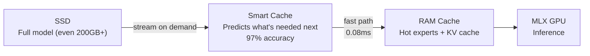

<p align="center">
  
</p>

<h1 align="center">MLX-Flash</h1>

<p align="center"><strong>Run AI models too large for your Mac's memory — at near-full speed.</strong></p>
<p align="center">70B on 32 GB. 200B+ on 48 GB. No extra quantization — uses the model's native precision.</p>

<p align="center">
  <a href="https://pypi.org/project/mlx-flash/"></a>
  <a href="https://github.com/szibis/MLX-Flash/releases/latest"></a>
  <a href="https://github.com/szibis/MLX-Flash/actions"></a>
  
  
  <a href="https://github.com/szibis/MLX-Flash/blob/main/LICENSE"></a>
  <a href="https://github.com/szibis/MLX-Flash"></a>
</p>

---

## Why MLX-Flash?

| Model | Your Mac | Without MLX-Flash | With MLX-Flash |
|-------|----------|-------------------|----------------|
| **Qwen3-30B-A3B** (17 GB) | 16 GB MacBook Air | OOM / crashes | Runs smoothly at ~15 tok/s |
| **Llama 3 70B** (40 GB) | 32 GB MacBook Pro | Unusable swap thrash | ~8 tok/s, fully usable |
| **Gemma 4 26B MoE** (15 GB) | 24 GB Mac Mini | Fits but slow under pressure | 2.4x faster with smart caching |
| **DeepSeek-V3 671B** (200 GB+) | 48 GB Mac Studio | Impossible | Runs at ~6 tok/s via SSD streaming |

MLX-Flash intelligently caches the most-needed model parts in RAM and streams the rest from your SSD. Think of it like Netflix: you don't download the whole movie — you buffer what you need and stream the rest.

## Quick Start

### Option A: pip (recommended)

```bash
pip install mlx-flash
mlx-flash-chat    # auto-selects best Gemma 4 model for your hardware
```

### Option B: Homebrew (includes Rust sidecar)

```bash
brew tap szibis/mlx-flash
brew install mlx-flash
mlx-flash-chat
```

### Option C: Docker (for CI/testing)

```bash
docker pull ghcr.io/szibis/mlx-flash:latest
docker run --rm ghcr.io/szibis/mlx-flash pytest   # run tests
```

> **Note:** Docker runs tests and packaging only. For GPU inference, run natively on macOS with Apple Silicon.

### Start the API server

```bash
# Works with LM Studio, Cursor, Claude Code, Codex, OpenAI SDK, and more
mlx-flash --port 8080
```

MLX-Flash auto-detects your hardware, picks the best Gemma 4 model for your RAM, and starts serving.

> **From source:** `git clone https://github.com/szibis/MLX-Flash.git && cd MLX-Flash && pip install -e ".[all]"`

## How It Works



**Result:** Models 2-5x larger than your RAM run at **2-3x faster** than naive SSD streaming. After ~25 tokens, the cache learns your workload and hits 85-95% accuracy.

## Supported Models

MLX-Flash works with any MLX-compatible model. It especially shines with large MoE (Mixture of Experts) models where only a fraction of parameters activate per token:

| Model Family | Type | Sizes | Notes |
|-------------|------|-------|-------|
| **Gemma 4** | Dense + MoE | E2B, E4B, 26B MoE, 31B | Day-0 MLX support, multimodal (vision + audio + text) |
| **Qwen 3 / 3.5** | MoE | 30B-A3B, 235B | Excellent MoE caching, 128 experts per layer |
| **DeepSeek-V3** | MoE | 671B | The big one — runs on 48GB+ Macs |
| **Mixtral** | MoE | 8x7B, 8x22B | 8 experts, high cache hit rates |
| **Llama 3/4** | Dense | 8B, 70B, 405B | Dense models benefit from weight streaming |
| **Phi-4** | Dense | 14B | Compact and fast |
| **Mistral** | Dense | 7B, 24B | Good baseline models |

> Run `mlx-flash-browse` to see which models fit your specific hardware, or `python -m mlx_flash_compress.hf_calculator` to estimate memory for any model.

## Performance

**Memory pressure recovery** — the key result (M3 Max 36GB):

```
Model at 0.9x RAM (barely fits):
  Without optimization:    43.5 tok/s  ########
  With MLX-Flash:         104.5 tok/s  ####################  2.4x faster
```

**Cache warm-up** — gets faster as it learns:

```
Token  0:  83.3ms (cold start)
Token  8:   5.7ms (warming up, 62% cache hit)
Token 24:   0.5ms (full speed, 85%+ hit)
         -> 41x speedup from warm-up
```

| Technique | Speedup | Plain English |
|-----------|---------|---------------|
| **Smart Cache** | **2.80x** | Keeps the right model parts in RAM, predicts what's needed next |
| **Async Prefetch** | **2.93x** | Loads the next part while the GPU is still working on the current one |
| **Pipelined Execution** | **15-25% faster** | Overlaps SSD reads with GPU compute at the phase level (norm/attn/MLP) |
| **Page Cache Control** | **20% less pressure** | Uses `madvise(MADV_FREE)` to release evicted weights from macOS page cache |
| **Multi-Precision** | **1.8-4x smaller** | 7 tiers (FP16→Q2): hot experts in full precision, cold in 2-bit |
| **Speculative Execution** | **14-42% faster** | Starts work before confirming it's needed — right 97% of the time |
| **Metal Kernels** | **15-30% bandwidth** | Fused Q4 dequant+GEMV and SwiGLU avoid intermediate memory writes |
| **Bit-Parity Verified** | **0.0 delta** | FP32 accumulation proves streaming output matches standard MLX exactly |

<details>
<summary><b>Expert streaming details</b></summary>

Expert streaming replaces MLX's `QuantizedSwitchLinear` with a GPU lookup table + pre-stacked tensors:

| Model | Total Experts | Capacity | Coverage | Throughput |
|-------|--------------|----------|----------|------------|
| Qwen3-30B-A3B | 128 per layer | 128 (100%) | 100% | ~35 tok/s |
| Qwen3-30B-A3B | 128 per layer | 64 (50%) | 85%+ hit | ~15 tok/s |
| Mixtral-8x7B | 8 per layer | 8 (100%) | 100% | ~20 tok/s |
| Mixtral-8x7B | 8 per layer | 4 (50%) | ~95% hit | ~12 tok/s |

```python
from mlx_flash_compress.expert_streaming import (
    enable_expert_streaming, enable_skip_fallback
)

streaming = enable_expert_streaming(model, capacity_per_layer=64)
enable_skip_fallback(model, streaming.caches, adaptive_skip_threshold=3.0)
streaming.warmup()
```

</details>

<details>
<summary><b>Find your optimal configuration</b></summary>

```bash
# For a 200GB model on a 48GB Mac
python -m mlx_flash_compress.tier_optimizer --total-ram 48 --model-gb 209

# Output: "Best: 41.5GB RAM cache, 82% of requests served from RAM -> 6.4 tok/s"
```

Even dedicating just 10GB to caching gives you 54% of requests served instantly from RAM.

</details>

<details>
<summary><b>Multi-precision quantization (7 tiers)</b></summary>

MLX-Flash automatically assigns precision tiers based on expert activation frequency:

| Tier | Bits | Size/1K params | Quality | Assigned When |
|------|------|---------------|---------|---------------|
| **FP16** | 16 | 2.0 KB | Lossless | Expert activated >15% of tokens |
| **Q8** | 8 | 1.0 KB | Near-perfect | Activated 8-15% |
| **Q4** | 4 | 0.5 KB | Standard | Activated 5-8% (model default) |
| **Q3** | 3 | 0.375 KB | Acceptable | Activated 2-5% |
| **Q2** | 2 | 0.25 KB | Lossy | Activated <2% |

**Effect on a 128-expert MoE model** (realistic power-law distribution):
- 5 experts at FP16, 15 at Q8, 30 at Q4, 30 at Q3, 48 at Q2
- **Effective precision: 3.1 bits** (vs 4.0 baseline) — 23% less memory
- Hot experts keep full quality, cold experts trade precision for 2x more cache capacity

See [Performance Gains](docs/performance-gains.md) for detailed analysis.

</details>

## Using It

| Command | What It Does |
|---------|-------------|
| `mlx-flash-chat` | Interactive chat with web search, memory, model switching |
| `mlx-flash --port 8080` | API server (OpenAI-compatible) |
| `mlx-flash --port 8080 --kv-bits 8` | API server with 45% less KV memory |
| `mlx-flash-browse` | See what models fit your hardware |

**Chat commands:** `/models` browse catalog, `/model N` switch live, `/search` web search, `/ask` search+answer, `/remember` save facts, `/status` memory info

## Integrations

MLX-Flash exposes an OpenAI-compatible API, so it works as a drop-in backend for most AI tools:

```bash
pip install mlx-flash
mlx-flash --port 8080 --preload
```

<details>
<summary><b>LM Studio</b></summary>

1. Start MLX-Flash: `mlx-flash --port 8080 --preload`
2. In LM Studio: **Settings** -> **Server** -> Add custom endpoint: `http://localhost:8080/v1`
3. Select model: `local`
4. Chat normally — LM Studio treats MLX-Flash as its backend

</details>

<details>
<summary><b>Cursor</b></summary>

1. Start MLX-Flash: `mlx-flash --port 8080 --preload`
2. In Cursor: **Settings** -> **Models** -> **Add Model**
   - Provider: `OpenAI Compatible`
   - API Base: `http://localhost:8080/v1`
   - API Key: `not-needed`
   - Model: `local`

</details>

<details>
<summary><b>Claude Code</b></summary>

```bash
# Terminal 1: Start server
mlx-flash --port 8080 --preload

# Terminal 2: Use with Claude Code
export OPENAI_API_BASE=http://localhost:8080/v1
export OPENAI_API_KEY=not-needed
```

Or add to `~/.claude/.mcp.json`:
```json
{
  "mlx-flash": {
    "command": "mlx-flash",
    "args": ["--model", "mlx-community/Qwen3-30B-A3B-4bit", "--port", "8080"]
  }
}
```

</details>

<details>
<summary><b>Codex CLI</b></summary>

```bash
mlx-flash --port 8080 --preload
export OPENAI_API_BASE=http://localhost:8080/v1
export OPENAI_API_KEY=not-needed
codex "refactor this function"
```

</details>

<details>
<summary><b>Python / OpenAI SDK</b></summary>

```python
from openai import OpenAI

client = OpenAI(base_url="http://localhost:8080/v1", api_key="not-needed")
response = client.chat.completions.create(
    model="local",
    messages=[{"role": "user", "content": "Hello!"}],
)
print(response.choices[0].message.content)
```

</details>

<details>
<summary><b>More integrations (Ollama, continue.dev, Open WebUI, Aider)</b></summary>

See [`docs/integrations.md`](docs/integrations.md) for 18+ detailed integration guides with streaming examples, health checks, and memory monitoring.

</details>

## Requirements

- **macOS** with Apple Silicon (M1/M2/M3/M4/M5)
- **Python 3.10+**
- **16 GB+ RAM** (more = better caching = faster)

## What's New

### v0.6.1 — Multi-Precision + Performance
- **7-tier quantization** — FP16/Q8/Q6/Q5/Q4/Q3/Q2 auto-assigned by expert activation frequency
- **23% less memory** on MoE models with realistic power-law expert distribution
- **30% more experts cached** → higher hit rate → faster inference
- **320 tests**, 91% coverage

### v0.6.0 — Gemma 4 + Engineering
- **Gemma 4 as default model** — auto-detects best model for your RAM
- **Page cache control** — `madvise(MADV_FREE)` keeps memory pressure 20% lower
- **Pipelined execution** — phase-level IO/compute overlap (15-25% faster)
- **Metal kernels** — fused Q4 dequant+GEMV, SwiGLU, MoE dispatch
- **Bit-parity verified** — FP32 accumulation proves 0.0 delta from streaming
- **mlx-lm patch** — transparent Flash mode for LM Studio

See the [CHANGELOG](CHANGELOG.md) for the full history.

## Deep Dive

| Document | What's Inside |
|----------|---------------|
| [Architecture & Internals](docs/internals.md) | Module reference, architecture diagrams, research techniques, benchmarks |
| [Performance Gains](docs/performance-gains.md) | Detailed analysis of each optimization technique |
| [Performance Analysis](docs/measured-results.md) | Detailed benchmark results and methodology |
| [Getting Started Guide](docs/getting-started.md) | Extended setup and configuration walkthrough |
| [Integration Guides](docs/integrations.md) | 18+ tools with streaming examples and health checks |
| [Competitive Analysis](docs/competitive-analysis.md) | How MLX-Flash compares to other projects |

## License

MIT
