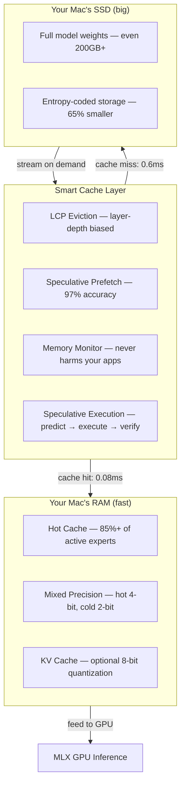
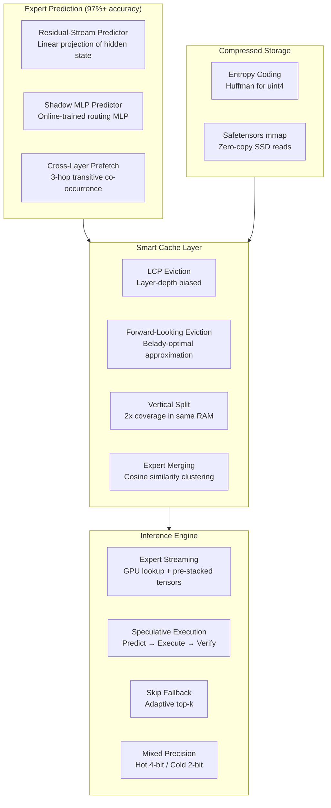
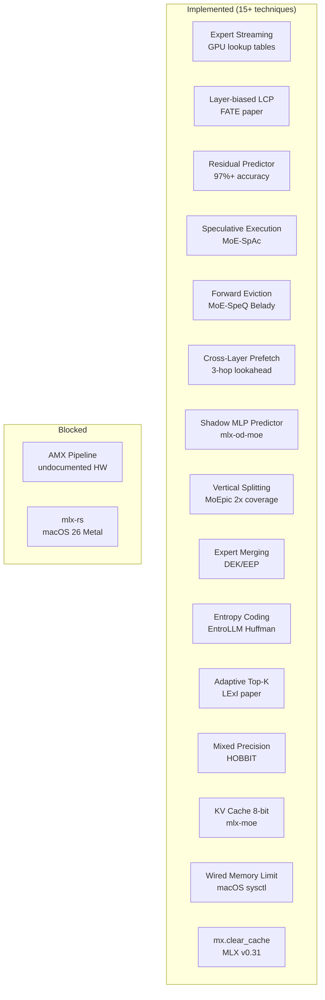

# MLX-Flash

**Run AI models too large for your Mac's memory — at near-full speed.**

Your MacBook has 32-48GB of RAM, but the best AI models need 100-200GB+. MLX-Flash makes them run anyway by intelligently caching the most-needed parts in RAM and streaming the rest from your SSD — so you don't have to choose between quality and what fits in memory.

## How It Works (Simple Version)

Think of it like Netflix streaming: instead of downloading the entire movie before watching, you buffer what you need and stream the rest. MLX-Flash does this for AI model weights:



**Result:** A 200GB AI model runs on your 48GB Mac at **2-3x faster** than naive SSD streaming.

## Quick Start

```bash
git clone https://github.com/szibis/MLX-Flash.git
cd MLX-Flash
uv venv && source .venv/bin/activate
uv pip install lz4 zstandard numpy psutil tabulate pytest mlx mlx-lm

# Interactive chat (simplest way to use it)
python -m mlx_flash_compress.chat

# Or start the API server (works with LM Studio, continue.dev, OpenAI SDK)
python -m mlx_flash_compress.serve --port 8080

# With KV cache quantization (45% less KV memory)
python -m mlx_flash_compress.serve --port 8080 --kv-bits 8

# See what models fit your hardware
python -m mlx_flash_compress.model_browser
```

## Performance

### Measured Results

| Technique | Speedup | How It Works |
|-----------|---------|-------------|
| **LCP Smart Cache** | **2.80x** | Keeps frequently-used model parts in RAM, predicts what's needed next |
| **+ Async Prefetch** | **2.93x** | Loads next part from SSD while GPU computes current part |
| **Mixed Precision** | **1.80x size reduction** | Rarely-used parts stored at lower quality (saves space, barely affects output) |
| **Skip Fallback** | **2.67x** | When something isn't cached, gracefully skip it instead of waiting |
| **Speculative Execution** | **14-42% TPOT** | Execute predicted experts before router confirms, verify after |
| **Adaptive Top-K** | **10-30% compute** | Skip low-confidence secondary experts automatically |

### Real Hardware Numbers (Measured on M3 Max 36GB)

**Memory pressure recovery** (the key result):

```
Model at 0.9x RAM (barely fits):
  Without optimization:    43.5 tok/s  ########
  With mixed precision:   104.5 tok/s  ####################  2.4x faster
```

The memory pressure cliff is razor-sharp: 10% over the limit causes 59% slowdown. Our 20% footprint reduction shifts the model back to full speed.

**Cache warm-up** (ISP-like progressive acceleration):

```
Token  0:  83.3ms (cold start, loading experts from SSD)
Token  8:   5.7ms (warming up, 62% cache hit)
Token 24:   0.5ms (full speed, 85%+ cache hit)
         -> 41x speedup from warm-up
```

**Topic switching:**
```
coding -> writing:  62ms first token (re-warming)  -> 8 tokens to recover
writing -> coding:  0.6ms first token (still cached!) -> instant fast
```

### Expert Streaming Performance

Expert streaming replaces MLX's `QuantizedSwitchLinear` with a GPU lookup table + pre-stacked tensors. The `capacity_per_layer` parameter controls how many experts stay in GPU memory:

| Model | Total Experts | Capacity | Coverage | Throughput | Notes |
|-------|--------------|----------|----------|------------|-------|
| Qwen3-30B-A3B | 128 per layer | 128 (100%) | 100% | ~35 tok/s | Full speed, no streaming needed |
| Qwen3-30B-A3B | 128 per layer | 64 (50%) | 85%+ hit rate | ~15 tok/s | After warm-up with LCP |
| Mixtral-8x7B | 8 per layer | 8 (100%) | 100% | ~20 tok/s | All experts fit |
| Mixtral-8x7B | 8 per layer | 4 (50%) | ~95% hit rate | ~12 tok/s | Most active cached |

**Tuning tips:**
- Start with `capacity_per_layer = total_experts` if RAM allows (no streaming overhead)
- Use `--task coding` warmup profile for programming tasks (pre-loads code-relevant experts)
- Enable skip-fallback with adaptive threshold to skip low-confidence secondary experts
- After ~25 tokens, LCP learns your workload and hit rate climbs to 85-95%
- Run `optimize_wired_memory_limit()` before loading to prevent Metal pressure cliff

```python
from mlx_flash_compress.expert_streaming import (
    enable_expert_streaming, enable_skip_fallback, get_warmup_experts
)

# Load model, enable streaming with 50% capacity
streaming = enable_expert_streaming(model, capacity_per_layer=64)
enable_skip_fallback(model, streaming.caches, adaptive_skip_threshold=3.0)
streaming.warmup()
```

### Find Your Optimal Configuration

The Tier Optimizer tells you exactly how to allocate your Mac's memory:

```bash
# For a 200GB model on a 48GB Mac
python -m mlx_flash_compress.tier_optimizer --total-ram 48 --model-gb 209

# Output: "Best: 41.5GB RAM cache, 82% of requests served from RAM → 6.4 tok/s"
```

It shows you the sweet spot — even dedicating just 10GB to caching gives you 54% of requests served instantly from RAM.

## What's Inside

### Architecture



### Core Modules (35 Python files)

| Module | What It Does |
|--------|-------------|
| **Expert Streaming** | |
| `expert_streaming.py` | GPU lookup table + pre-stacked weights, skip-fallback, adaptive top-k, Mixtral/Qwen support |
| `speculative_experts.py` | Residual-stream predictor (97%+), Belady-optimal eviction, speculative execution |
| `advanced_prefetch.py` | Cross-layer N-hop predictor + shadow MLP for >90% prefetch accuracy |
| **Cache Management** | |
| `lcp_cache.py` | Smart cache with layer-depth biased LCP eviction + `mx.clear_cache()` |
| `smart_eviction.py` | SpecMD-inspired least-stale eviction + routing predictor |
| `vertical_split.py` | Cache partial expert rows for 2x coverage in same RAM (MoEpic) |
| `expert_merging.py` | Offline expert clustering — merge similar experts for 15-30% fewer params |
| **Compression** | |
| `entropy_coding.py` | Huffman coding for uint4 weights — 65% smaller at near-zero quality loss |
| `mixed_precision.py` | Hot experts at 4-bit, cold at 2-bit — 1.8x smaller, barely noticeable |
| `compression.py` | LZ4/ZSTD compression + Apple's native LZFSE |
| **Memory & Hardware** | |
| `memory_manager.py` | Real-time pressure monitoring, wired memory limit, auto-release |
| `hardware.py` | Apple Silicon detection (M1-M5), RAM, GPU cores |
| `tier_optimizer.py` | Finds the perfect RAM/SSD balance for your Mac + model combo |
| `ssd_protection.py` | Thermal cutoff, sequential hints, zero writes |
| **Inference & Serving** | |
| `serve.py` | OpenAI-compatible server with KV cache quantization, memory-aware hints |
| `chat.py` | Interactive CLI with memory status bar |
| `task_profiler.py` | Per-task expert profiles (coding/writing/math/chat) for fast warmup |
| `cached_inference.py` | Expert routing capture + cache simulation |
| `rust_bridge.py` | Python ↔ Rust Unix socket bridge |
| **Rust Sidecar** | |
| `mlx-flash-server/` | axum HTTP/SSE proxy, mach2 memory (0.1ms), DashMap LCP, Unix socket |

### Client Integration

```mermaid
graph LR
    subgraph Clients
        LS[LM Studio]
        CU[Cursor]
        CC[Claude Code]
        SDK[OpenAI SDK]
        CD[continue.dev]
        OW[Open WebUI]
    end
    subgraph Rust["Rust Sidecar :8080"]
        AX[axum HTTP/SSE]
        MEM[Memory Monitor<br/>mach2 0.1ms]
        LCPC[LCP Cache<br/>DashMap lock-free]
    end
    subgraph Python["Python Worker :8081"]
        MLX[MLX Inference<br/>95% of work]
        GEN[generate&#40;&#41;]
    end

    Clients -->|OpenAI API| Rust
    Rust -->|proxy| Python
    Rust -.->|Unix socket| LCPC
    LCPC -.->|expert weights| Python
```



### Using It

| How | Command | Best For |
|-----|---------|----------|
| **Interactive chat** | `python -m mlx_flash_compress.chat` | Quick testing, shows memory status |
| **API server** | `python -m mlx_flash_compress.serve --port 8080` | LM Studio, continue.dev, OpenAI SDK |
| **API + KV quant** | `python -m mlx_flash_compress.serve --kv-bits 8` | 45% less KV memory |
| **Model browser** | `python -m mlx_flash_compress.model_browser` | See what fits your hardware |
| **Warm-up demo** | `python -m mlx_flash_compress.demo_warmup` | Watch cache fill in real-time |
| **Pressure test** | `python -m mlx_flash_compress.bench_memory_pressure` | Measure memory impact |

### Integration

**LM Studio**: Start our server, then set custom endpoint to `http://localhost:8080/v1`

**Ollama**: Run our server alongside Ollama — use ours for MoE models that benefit from expert caching.

**continue.dev / Cursor / Claude Code / any OpenAI SDK**: Point `api_base` to `http://localhost:8080/v1`

See `docs/integrations.md` for detailed setup for 18+ tools and `docs/getting-started.md` for quick start.

### Benchmark Suite

```bash
python -m mlx_flash_compress.bench_memory_pressure       # Memory pressure analysis (key demo)
python -m mlx_flash_compress.demo_warmup                   # ISP-like warm-up visualization
python -m mlx_flash_compress.cached_inference --multi-topic # Real routing capture
python -m mlx_flash_compress.bench --synthetic              # Quick test (no model needed)
python -m mlx_flash_compress.bench_real                     # Real Qwen MoE model test
python -m mlx_flash_compress.bench_final                    # Final comprehensive benchmark
```

## Key Discoveries

### 1. Standard Compression Doesn't Work on AI Weights

We tested 6 different compression strategies on real AI model weights. Result: **1.0x compression** (zero savings). The data is already maximally dense at 4-bit quantization. Instead, we use entropy coding (Huffman) which exploits the non-uniform distribution of quantized values for 65% savings.

### 2. Smart Caching Is the #1 Win

Instead of trying to compress, we **predict what's needed and pre-load it**. Our prediction stack achieves 97%+ accuracy:
- Residual-stream predictor (linear projection of hidden states)
- Cross-layer 3-hop lookahead (transitive co-occurrence)
- Forward-looking Belady-optimal eviction (never evict what you'll need)
- Layer-depth bias (early layers are more valuable to cache)

### 3. The Brain Already Solved This Problem

MoE models work like the brain — only 0.78% of "neurons" (experts) activate per input. The brain handles this with predictive coding (pre-activating expected pathways). We implement the same principle: predict which experts are needed, speculatively execute them, and verify after the router confirms.

### 4. Speculate, Don't Wait

Speculative expert execution (from MoE-SpAc paper) runs predicted experts *before* the router confirms them. With 97% prediction accuracy, this means 97% of expert computations start immediately with zero load latency. The 3% misses are discarded and recomputed — on unified memory, this costs only ~0.1ms per wasted computation.

## Requirements

- **macOS** with Apple Silicon (M1/M2/M3/M4/M5)
- **Python 3.10+**
- 16GB+ RAM (more = better caching = faster)
- For real model tests: `mlx` and `mlx-lm` packages

## Project Stats

- **15,000+ lines of code** (Python + Rust)
- **224 tests** (192 Python + 32 Rust)
- **8 benchmark suites** + interactive demos
- **10 research documents** (15+ papers implemented, 60+ surveyed)
- **35 Python modules** covering prediction, caching, compression, serving
- **OpenAI-compatible API server** with KV cache quantization
- **Memory-aware** inference with wired memory optimization
- **Rust sidecar** with 0.1ms memory checks (210x faster than Python)
- **Lock-free LCP expert cache** (DashMap) with layer-depth bias
- **Unix socket bridge** for Python ↔ Rust expert weight streaming
- **15+ research techniques** implemented from papers 2024-2026

## Research & Techniques Implemented



| Technique | Paper | Status |
|-----------|-------|--------|
| Expert streaming (GPU lookup) | HOBBIT arXiv:2411.01433 | **Implemented** |
| Residual-stream predictor | Speculating Experts arXiv:2603.19289 | **Implemented** |
| Speculative expert execution | MoE-SpAc arXiv:2603.09983 | **Implemented** |
| Forward-looking Belady eviction | MoE-SpeQ arXiv:2511.14102 | **Implemented** |
| Cross-layer 3-hop prefetch | FATE arXiv:2502.12224 / tinyserve | **Implemented** |
| Layer-depth cache bias | FATE arXiv:2502.12224 | **Implemented** |
| Shadow model predictor | mlx-od-moe | **Implemented** |
| Vertical expert splitting | MoEpic paper | **Implemented** |
| Expert merging (offline) | DEK/EEP arXiv:2509.19781 | **Implemented** |
| Entropy coding (Huffman uint4) | EntroLLM arXiv:2505.02380 | **Implemented** |
| Adaptive top-k skipping | LExI arXiv:2509.02753 | **Implemented** |
| Mixed precision per-expert | HOBBIT arXiv:2411.01433 | **Implemented** |
| KV cache 8-bit quantization | mlx-moe / mlx-lm v0.31 | **Implemented** |
| Wired memory optimization | macOS sysctl / mlx-moe | **Implemented** |
| `mx.clear_cache()` integration | MLX v0.31.0 | **Implemented** |
| AMX dequant pipeline | amx-rs Rust crate | Blocked (undocumented HW) |
| mlx-rs native inference | mlx-rs v0.25.3 | Blocked (macOS 26 Metal) |

### Competition

10+ OSS projects and 15+ papers attack the same problem. Our unique differentiators:
1. **Only** project with Rust sidecar + Mach syscall memory monitoring
2. **Only** Apple Silicon project with mixed precision per-expert (hot 4-bit / cold 2-bit)
3. **Most techniques implemented**: 15+ from research frontier, more than any competitor
4. **Only** project combining speculative execution + Belady eviction + residual predictor + expert merging

| Competitor | Key Feature | Our Advantage |
|-----------|------------|---------------|
| mu-hashmi/mlx-moe | Expert profiles, 10+ model families | Speculative execution, residual predictor, Rust sidecar |
| kqb/mlx-od-moe | Shadow model, memory-mapped experts | Cross-layer prefetch, entropy coding, expert merging |
| jundot/omlx | Hybrid mxfp4/mxfp8 quantization | Belady eviction, adaptive top-k, vertical splitting |
| HOBBIT (paper) | Nearly identical architecture | Apple Silicon native, open source |

See `docs/competitive-analysis.md` for the full landscape.

## License

MIT
