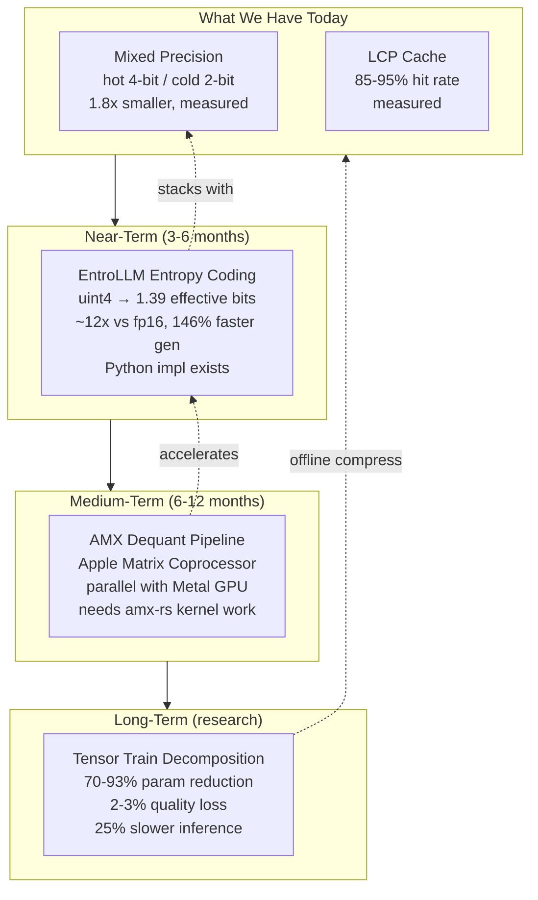
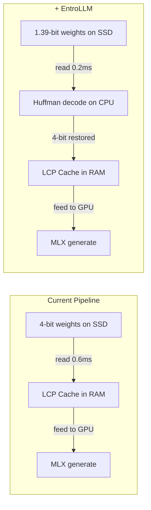
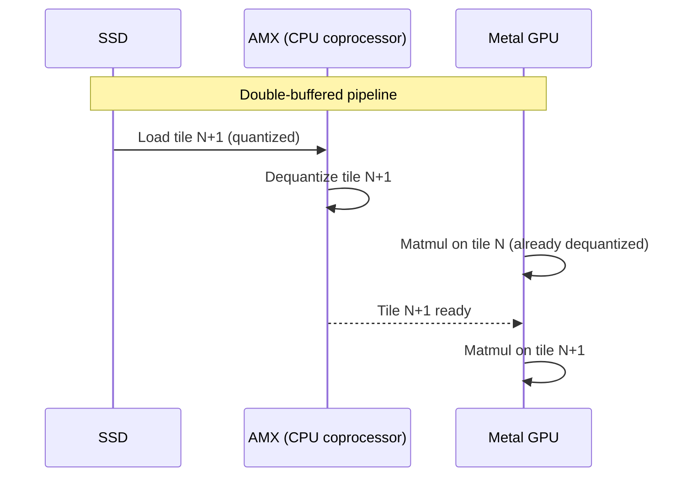
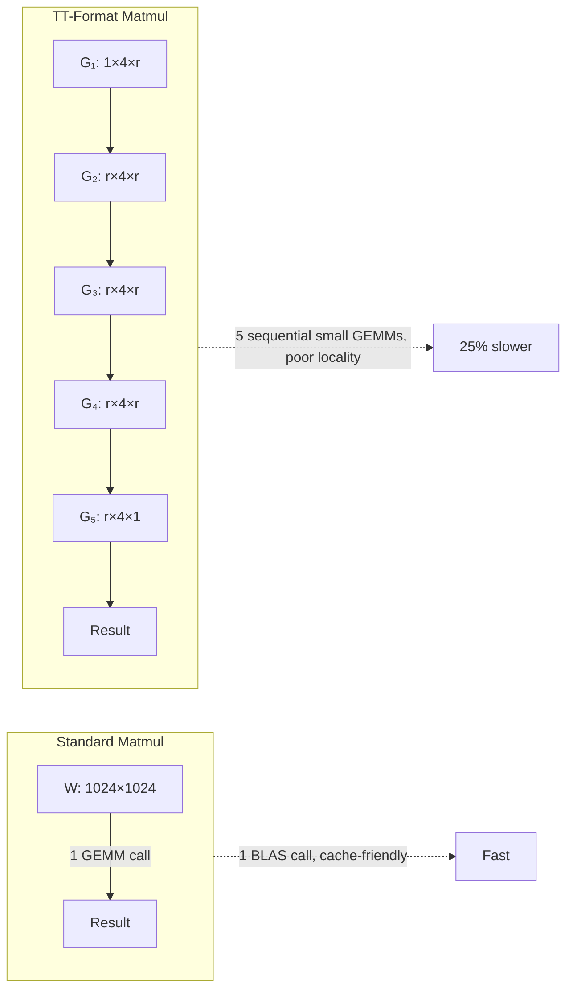
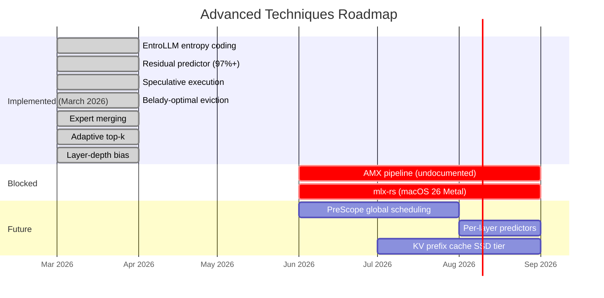

# Advanced Techniques: Research Frontier

Three techniques that could deliver 2-12x additional compression beyond our current mixed precision approach. Each is at a different maturity level.

## Overview



## 1. EntroLLM: Entropy Coding (Highest Impact, Shortest Path)

**Paper:** arXiv:2505.02380 | **Code:** github.com/arnabsanyal/EntroLLM

### The Idea

Standard 4-bit quantization stores each weight in exactly 4 bits. But the distribution of quantized values is highly non-uniform — some values are much more frequent. EntroLLM applies Huffman coding to exploit this, achieving **effective bit-widths far below the nominal precision**.

The key trick: use **tensor-level quantization** (one scale per tensor) instead of block-level (per-group). This makes the distribution spikier, increasing Huffman compression effectiveness.

### Numbers

| Format | Nominal | Effective | Savings | Combined vs fp16 |
|--------|---------|-----------|---------|-------------------|
| Standard uint8 | 8 bits | ~8 bits | 0% | 2x |
| EntroLLM uint8 | 8 bits | **5.58 bits** | **30%** | 2.9x |
| Standard uint4 | 4 bits | ~4 bits | 0% | 4x |
| EntroLLM uint4 | 4 bits | **1.39 bits** | **65%** | **~12x** |

### Quality

Mistral-7B Wikitext2 perplexity:
- fp16 baseline: 8.17
- Standard uint4 (GPTQ): 8.28 (+0.11)
- EntroLLM uint4: 8.29 (+0.12)

**Essentially zero additional quality loss** vs standard quantization.

### Inference Speed

Measured on NVIDIA Jetson (comparable compute class to Apple Silicon):

| Metric | uint4 Standard | uint4 EntroLLM | Speedup |
|--------|---------------|----------------|---------|
| Token generation | baseline | **146.6% faster** | 2.5x |
| Prefill | baseline | 13.3% faster | 1.1x |

The 2.5x token generation speedup comes from reduced DRAM bandwidth — each token requires loading all weights, and 65% smaller weights = 65% less data to load. The Huffman decode overhead is cheaper than the bandwidth saved.

### Applicability to MLX-Flash-Compress



**Impact on our system:**
- SSD reads 65% faster (less data)
- Cache holds 2.9x more experts in same RAM
- Cache warm-up 2.9x faster (more experts fit)
- Requires re-quantizing models with tensor-level scale factors

**Implementation path:** Python impl exists (PyTorch). Would need porting to work with MLX's quantized format. The parallel Huffman decoder could run on Apple's efficiency cores while Metal GPU runs inference.

### Honest Assessment

**What's real:** The compression ratios and perplexity numbers are published and reproducible. The bandwidth-reduction speedup is directionally correct for any memory-bandwidth-bound platform.

**What's uncertain:** No Apple Silicon benchmarks exist. The parallel Huffman decoder hasn't been tested with MLX's runtime. Changing from block-level to tensor-level quantization means existing GGUF/MLX models can't use this without re-quantizing.

**Priority: HIGH** — highest impact-to-effort ratio of the three techniques.

---

## 2. AMX Dequantization Pipeline (Medium Impact, Novel)

### What AMX Is

Apple AMX (Apple Matrix eXtensions) is an **undocumented** matrix coprocessor in every M1-M4 chip. It's separate from:
- CPU NEON/SVE (SIMD)
- Metal GPU
- Apple Neural Engine (ANE)

AMX has its own 5KB register file (8x X registers, 8x Y registers, 64x Z registers, each 64 bytes) and executes FMA operations posted via the CPU store unit.

### Key Specs

| Feature | Value |
|---------|-------|
| Registers | 5120 bytes (X: 512B, Y: 512B, Z: 4096B) |
| Peak throughput | ~2 TFLOPS (f32) on M1 Pro |
| Data types | f16, f32, f64, int16 (no native int8!) |
| Parallelism | Runs alongside CPU and GPU simultaneously |
| API | None (undocumented). Accessed via `amx-rs` Rust crate |
| Memory | Shares L2 cache with CPU cores |

### The Opportunity

AMX can dequantize weight tiles **in parallel with Metal GPU compute**:



Since Apple Silicon uses unified memory, there's **no PCIe copy** between AMX and GPU — both see the same DRAM.

### The Catch

| Operation | Cycles | Notes |
|-----------|--------|-------|
| AMX load (128 bytes) | 9 cycles | Baseline |
| CPU store + AMX load | **47 cycles** | 5x penalty! |
| CPU store + AMX load (aliasing) | **93-103 cycles** | 10x penalty |

Any "dequantize on CPU → store → load in AMX" pipeline suffers a **5-10x penalty**. The correct approach requires dequantizing **inside AMX** using the `AMXGENLUT` lookup-table instruction — which maps naturally to codebook-based quantization.

### Rust Access

```rust
// amx-rs crate (github.com/yvt/amx-rs)
use amx::prelude::*;

ctx.outer_product_f32_xy_to_z(
    Some(XBytes(0)),  // dequantized weights in X
    Some(YBytes(0)),  // activations in Y
    ZRow(0),          // result in Z
    false,            // don't accumulate
);
```

### Honest Assessment

**What's real:** AMX exists, `amx-rs` provides Rust bindings, the throughput numbers are reverse-engineered and verified.

**What's uncertain:** No one has built an LLM dequantization kernel on AMX. The 47-cycle store+load penalty makes naive approaches slower than GPU-only. The `AMXGENLUT` instruction for in-register dequant is poorly documented.

**Priority: MEDIUM** — novel but requires significant R&D. Best combined with EntroLLM (AMX decodes Huffman while GPU computes).

---

## 3. Tensor Train Decomposition (Highest Compression, Research Stage)

### What It Is

Tensor Train (TT) decomposition factorizes a weight matrix into a chain of smaller 3D "core" tensors:

```
W(m, n) → G₁(1, m₁, r₁) × G₂(r₁, m₂, r₂) × ... × Gₖ(rₖ₋₁, mₖ, 1)
```

The "TT-ranks" r₁...rₖ₋₁ control compression vs. quality.

### Numbers

**CompactifAI (arXiv:2401.14109) on LLaMA 7B:**

| Metric | Value |
|--------|-------|
| Memory reduction | **93%** (with quantization) |
| Parameter reduction | 70% (TT alone) |
| Inference speedup | -25% (slower due to sequential core matmuls) |
| Accuracy drop | 2-3% |

**Key finding:** Deeper transformer layers are more compressible — they have lower effective rank. This aligns with MoE models where later-layer experts show more redundancy.

### Why It's Not Used in Practice



TT converts one large cache-friendly GEMM into k sequential small GEMMs with poor memory locality. This is why CompactifAI saw 25% slower inference despite 93% less memory.

### Best Use: Offline Compression

TT is most useful as a **storage/distribution** format, not an inference format:
1. Train or fine-tune in TT format (70% fewer parameters = faster training)
2. Re-densify for inference (decompress to standard weight matrices)
3. Apply quantization + EntroLLM on the densified weights
4. Ship the compressed model

### Available Implementations

- `tntorch` (Python, PyTorch) — full TT decomposition toolkit
- `t3f` (Python, TensorFlow) — TT-format operations
- No Rust implementation exists

### Honest Assessment

**What's real:** 93% memory reduction with TT+quantization on LLaMA 7B is published. The math is well-understood (MPS/TT from quantum physics).

**What's uncertain:** No one has applied TT to MoE expert weights. The 25% inference slowdown is a real cost. CompactifAI's code is not publicly available.

**Priority: LOW for inference, MEDIUM for model distribution** — use offline to shrink models for download, then convert to standard format for inference.

---

## 4. New Techniques (Implemented March 2026)

These techniques were researched and implemented from the latest papers:

### Residual-Stream Predictor (Speculating Experts, arXiv:2603.19289)

Instead of training an MLP shadow model, use the pre-MoE hidden state directly via linear projection. Adjacent layers have >97% cosine similarity in gate inputs, so a single matrix multiply achieves 97-99% prediction accuracy with zero additional GPU overhead.

**Status: Implemented** in `speculative_experts.py`

### Forward-Looking Belady-Optimal Eviction (MoE-SpeQ, arXiv:2511.14102)

Standard LCP looks backward (frequency × decay). Forward-looking eviction integrates predictions: if a predictor says expert E will be needed in 2 steps, it's protected from eviction regardless of LCP score. This approximates the theoretically optimal Belady replacement policy.

**Status: Implemented** in `speculative_experts.py`

### Speculative Expert Execution (MoE-SpAc, arXiv:2603.09983)

Execute predicted experts *before* the router confirms, then verify. With 97% prediction accuracy, 97% of expert computations are reused directly. On unified memory (Apple Silicon), the speculation cost is just redundant GPU compute (~0.1ms) vs memory load (~0.5ms). 14-42% TPOT reduction.

**Status: Implemented** in `speculative_experts.py`

### Expert Merging (DEK/EEP, arXiv:2509.19781)

Offline: cluster experts by weight cosine similarity, merge similar ones into "super-experts" with averaged weights. Reduces unique expert count by 15-30% without accuracy loss. Complementary to vertical splitting (which goes the other direction).

**Status: Implemented** in `expert_merging.py`

### Adaptive Top-K (LExI, arXiv:2509.02753)

When the router's top-1 score is much higher than top-2 (low routing entropy), skip the second expert entirely. Saves 10-30% compute with <1% quality loss. Gated by `adaptive_skip_threshold` parameter.

**Status: Implemented** in `expert_streaming.py` (enable_skip_fallback)

### Layer-Depth Cache Bias (FATE, arXiv:2502.12224)

Early transformer layers have more predictable routing patterns. Bias the LCP score by layer depth: `score × (1 + bias × (1 - layer_position))`. Early-layer experts are pinned preferentially.

**Status: Implemented** in `expert_streaming.py` (LCPTracker)

---

## Combined Roadmap



## Summary

| Technique | Gain | Status | Paper |
|-----------|------|--------|-------|
| EntroLLM uint4 | 65% smaller, 2.5x gen speed | **Implemented** | arXiv:2505.02380 |
| Residual predictor | 97%+ accuracy | **Implemented** | arXiv:2603.19289 |
| Speculative execution | 14-42% TPOT | **Implemented** | arXiv:2603.09983 |
| Belady-optimal eviction | +10-20% hit rate | **Implemented** | arXiv:2511.14102 |
| Expert merging | 15-30% fewer experts | **Implemented** | arXiv:2509.19781 |
| Adaptive top-k | 10-30% compute reduction | **Implemented** | arXiv:2509.02753 |
| Layer-depth bias | +5-10% hit rate | **Implemented** | arXiv:2502.12224 |
| Shadow MLP predictor | >90% accuracy | **Implemented** | mlx-od-moe |
| Cross-layer 3-hop | N-layer lookahead | **Implemented** | FATE/tinyserve |
| Vertical splitting | 2x cache coverage | **Implemented** | MoEpic |
| AMX dequant | Parallel decode+compute | Blocked | undocumented HW |
| mlx-rs native | Eliminate Python | Blocked | macOS 26 Metal |
| PreScope scheduling | 141% throughput | Future | arXiv:2509.23638 |
