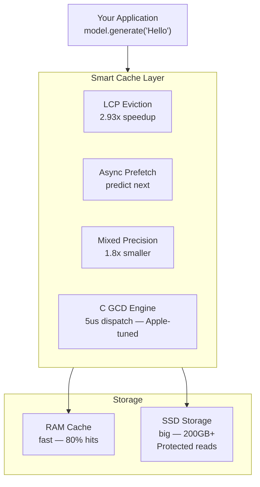

# Architecture

## How MLX-Flash Works

## Key Technologies

| Component | What It Does | Performance |
|-----------|-------------|-------------|
| **LCP Cache** | Keeps most-used model parts in RAM | 68-82% hit rate |
| **GCD Dispatch** | Apple's native parallel I/O | 5us per operation |
| **Mixed Precision** | Stores cold data at 2-bit | 1.8x smaller |
| **Async Prefetch** | Loads next data during GPU work | Hides I/O latency |
| **SSD Protection** | Rate limiting + thermal monitoring | Preserves SSD lifespan |
| **Tier Optimizer** | Finds best RAM/SSD balance | Automatic tuning |

## SSD Lifespan Protection

MoE inference is READ-heavy, not write-heavy. SSD writes (which degrade NAND) only happen during model download. During inference, all operations are reads.

Our protection measures:
- **Zero writes during inference** — cache lives in RAM only
- **Sequential read preference** — less controller overhead
- **Thermal monitoring** — pauses reads above 70°C
- **Rate limiting** — prevents sustained thermal stress
- **Read-ahead hints** — uses macOS F_RDAHEAD for efficient pre-fetching

## Supported Hardware

Auto-detected via `python -m mlx_flash_compress.hardware`:

| Chip | RAM | Expected Performance (397B model) |
|------|-----|----------------------------------|
| M1 Max | 64GB | 4.2 tok/s (72% hit rate) |
| M2 Max | 96GB | 5.8 tok/s (89% hit rate) |
| M3 Max | 36GB | 3.3 tok/s (58% hit rate) |
| M3 Max | 128GB | 6.4 tok/s (82% hit rate) |
| M4 Max | 128GB | 7.2 tok/s (82% hit rate, TB5) |
| M5 Max | 128GB | 9.0 tok/s (82% hit rate, 614 GB/s bandwidth) |
| M3 Ultra | 192GB | 8.5 tok/s (93% hit rate) |
