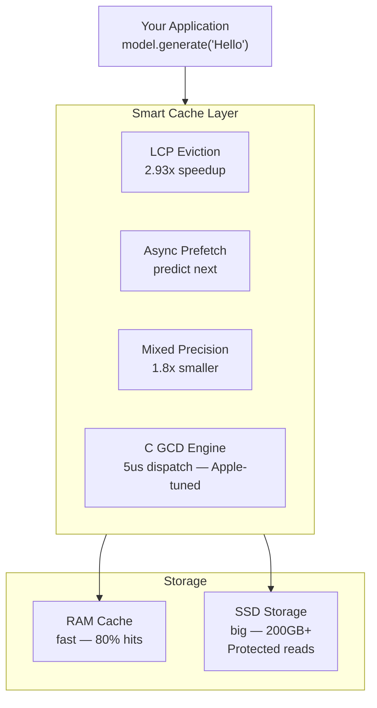

# Architecture

## How MLX-Flash Works



## Server Architecture

```mermaid
flowchart TB
    CLIENT["Clients\n(LM Studio, Cursor, Claude Code, SDK)"]

    subgraph RUST["Rust Proxy :8080"]
        ROUTER[Session Router\nleast-connections + cache-affinity]
        METRICS[/metrics\nPrometheus]
        DASH[/admin\nDashboard]
        HEALTH[Health Checker\nevery 10s + auto-restart]
        LOGS[Log Buffer\n/logs/recent]
    end

    subgraph WORKERS["Python Workers"]
        W1["Worker :8081\nModel + KV cache"]
        W2["Worker :8082\nModel + KV cache"]
        WN["Worker :808N"]
    end

    CLIENT --> RUST
    ROUTER -->|session sticky| W1
    ROUTER -->|least loaded| W2
    ROUTER -->|overflow| WN
    HEALTH -.->|poll /health| W1
    HEALTH -.->|poll /health| W2
    HEALTH -.->|auto-restart if dead| WN
    METRICS -.->|aggregate /status| W1
    METRICS -.->|aggregate /status| W2
```

**Single command starts everything:**
```bash
mlx-flash-server --port 8080 --model mlx-community/Qwen3-30B-A3B-4bit --workers 2
```
- Auto-detects Python venv, launches workers, health-checks until ready
- Workers auto-restart if they crash (health checker every 10s)
- `/metrics` aggregates Rust + all Python stats (single Prometheus scrape target)
- `/admin` dashboard shows live logs, worker controls, memory breakdown

**Endpoints:**

| Endpoint | Method | What |
|----------|--------|------|
| `/v1/chat/completions` | POST | OpenAI-compatible inference (proxied to workers) |
| `/v1/models/switch` | POST | Hot-swap model across all workers |
| `/admin` | GET | Live dashboard (charts, workers, logs) |
| `/chat` | GET | Chat UI with model switching |
| `/metrics` | GET | Prometheus metrics (35+ metrics) |
| `/workers` | GET | Worker pool status + session mapping |
| `/workers/restart` | POST | Restart specific or all unhealthy workers |
| `/reload` | POST | Refresh worker health |
| `/shutdown` | POST | Graceful shutdown |
| `/logs/recent` | GET | Last 100 structured log entries |
| `/health` | GET | Health check (JSON) |
| `/status` | GET | Full status (memory, stats, hints) |

## Key Technologies

| Component | What It Does | Performance |
|-----------|-------------|-------------|
| **LCP Cache** | Keeps most-used model parts in RAM | 68-82% hit rate |
| **GCD Dispatch** | Apple's native parallel I/O | 5us per operation |
| **Mixed Precision** | Stores cold data at 2-bit | 1.8x smaller |
| **Async Prefetch** | Loads next data during GPU work | Hides I/O latency |
| **SSD Protection** | Rate limiting + thermal monitoring | Preserves SSD lifespan |
| **Tier Optimizer** | Finds best RAM/SSD balance | Automatic tuning |

## SSD Lifespan Protection

MoE inference is READ-heavy, not write-heavy. SSD writes (which degrade NAND) only happen during model download. During inference, all operations are reads.

Our protection measures:
- **Zero writes during inference** — cache lives in RAM only
- **Sequential read preference** — less controller overhead
- **Thermal monitoring** — pauses reads above 70°C
- **Rate limiting** — prevents sustained thermal stress
- **Read-ahead hints** — uses macOS F_RDAHEAD for efficient pre-fetching

## Supported Hardware

Auto-detected via `python -m mlx_flash_compress.hardware`:

| Chip | RAM | Expected Performance (397B model) |
|------|-----|----------------------------------|
| M1 Max | 64GB | 4.2 tok/s (72% hit rate) |
| M2 Max | 96GB | 5.8 tok/s (89% hit rate) |
| M3 Max | 36GB | 3.3 tok/s (58% hit rate) |
| M3 Max | 128GB | 6.4 tok/s (82% hit rate) |
| M4 Max | 128GB | 7.2 tok/s (82% hit rate, TB5) |
| M5 Max | 128GB | 9.0 tok/s (82% hit rate, 614 GB/s bandwidth) |
| M3 Ultra | 192GB | 8.5 tok/s (93% hit rate) |
