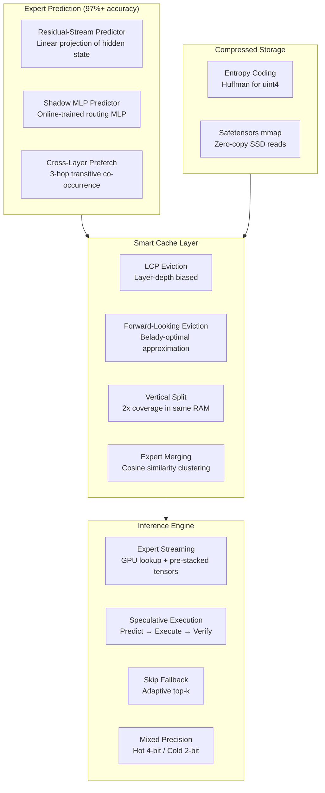
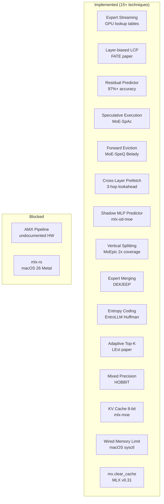

# Internals & Module Reference

## Architecture



## Core Modules (35 Python files)

| Module | What It Does |
|--------|-------------|
| **Expert Streaming** | |
| `expert_streaming.py` | GPU lookup table + pre-stacked weights, skip-fallback, adaptive top-k, Mixtral/Qwen support |
| `speculative_experts.py` | Residual-stream predictor (97%+), Belady-optimal eviction, speculative execution |
| `advanced_prefetch.py` | Cross-layer N-hop predictor + shadow MLP for >90% prefetch accuracy |
| **Cache Management** | |
| `lcp_cache.py` | Smart cache with layer-depth biased LCP eviction + `mx.clear_cache()` |
| `smart_eviction.py` | SpecMD-inspired least-stale eviction + routing predictor |
| `vertical_split.py` | Cache partial expert rows for 2x coverage in same RAM (MoEpic) |
| `expert_merging.py` | Offline expert clustering — merge similar experts for 15-30% fewer params |
| **Compression** | |
| `entropy_coding.py` | Huffman coding for uint4 weights — 65% smaller at near-zero quality loss |
| `mixed_precision.py` | Hot experts at 4-bit, cold at 2-bit — 1.8x smaller, barely noticeable |
| `compression.py` | LZ4/ZSTD compression + Apple's native LZFSE |
| **Memory & Hardware** | |
| `memory_manager.py` | Real-time pressure monitoring, wired memory limit, auto-release |
| `hardware.py` | Apple Silicon detection (M1-M5), RAM, GPU cores |
| `tier_optimizer.py` | Finds the perfect RAM/SSD balance for your Mac + model combo |
| `ssd_protection.py` | Thermal cutoff, sequential hints, zero writes |
| **Inference & Serving** | |
| `serve.py` | OpenAI-compatible server with KV cache quantization, memory-aware hints |
| `chat.py` | Colorful chat CLI with web search, memory, model switching |
| `web_search.py` | DuckDuckGo search + persistent memory store (Perplexity-style) |
| `hf_calculator.py` | Model size/memory estimator for any MoE or dense model |
| `task_profiler.py` | Per-task expert profiles (coding/writing/math/chat) for fast warmup |
| **Distributed** | |
| `distributed_experts.py` | Multi-Mac expert parallelism over Thunderbolt 5 RDMA |
| `kv_cache_sharing.py` | PT-MoE KV-cache sharing between blocks (37.5% memory savings) |
| `cached_inference.py` | Expert routing capture + cache simulation |
| `rust_bridge.py` | Python ↔ Rust Unix socket bridge |
| **Rust Sidecar** | |
| `mlx-flash-server/` | axum HTTP/SSE proxy, mach2 memory (0.1ms), DashMap LCP, Unix socket |

## Client Integration Architecture

```mermaid
graph LR
    subgraph Clients
        LS[LM Studio]
        CU[Cursor]
        CC[Claude Code]
        SDK[OpenAI SDK]
        CD[continue.dev]
        OW[Open WebUI]
    end
    subgraph Rust["Rust Sidecar :8080"]
        AX[axum HTTP/SSE]
        MEM[Memory Monitor<br/>mach2 0.1ms]
        LCPC[LCP Cache<br/>DashMap lock-free]
    end
    subgraph Python["Python Worker :8081"]
        MLX[MLX Inference<br/>95% of work]
        GEN[generate&#40;&#41;]
    end

    Clients -->|OpenAI API| Rust
    Rust -->|proxy| Python
    Rust -.->|Unix socket| LCPC
    LCPC -.->|expert weights| Python
```



## Benchmark Suite

```bash
python -m mlx_flash_compress.bench_memory_pressure       # Memory pressure analysis (key demo)
python -m mlx_flash_compress.demo_warmup                   # ISP-like warm-up visualization
python -m mlx_flash_compress.cached_inference --multi-topic # Real routing capture
python -m mlx_flash_compress.bench --synthetic              # Quick test (no model needed)
python -m mlx_flash_compress.bench_real                     # Real Qwen MoE model test
python -m mlx_flash_compress.bench_final                    # Final comprehensive benchmark
```

## Key Discoveries

### 1. Standard Compression Doesn't Work on AI Weights

We tested 6 different compression strategies on real AI model weights. Result: **1.0x compression** (zero savings). The data is already maximally dense at 4-bit quantization. Instead, we use entropy coding (Huffman) which exploits the non-uniform distribution of quantized values for 65% savings.

### 2. Smart Caching Is the #1 Win

Instead of trying to compress, we **predict what's needed and pre-load it**. Our prediction stack achieves 97%+ accuracy:
- Residual-stream predictor (linear projection of hidden states)
- Cross-layer 3-hop lookahead (transitive co-occurrence)
- Forward-looking Belady-optimal eviction (never evict what you'll need)
- Layer-depth bias (early layers are more valuable to cache)

### 3. The Brain Already Solved This Problem

MoE models work like the brain — only 0.78% of "neurons" (experts) activate per input. The brain handles this with predictive coding (pre-activating expected pathways). We implement the same principle: predict which experts are needed, speculatively execute them, and verify after the router confirms.

### 4. Speculate, Don't Wait

Speculative expert execution (from MoE-SpAc paper) runs predicted experts *before* the router confirms them. With 97% prediction accuracy, this means 97% of expert computations start immediately with zero load latency. The 3% misses are discarded and recomputed — on unified memory, this costs only ~0.1ms per wasted computation.

## Research & Techniques Implemented



| Technique | Paper | Status |
|-----------|-------|--------|
| Expert streaming (GPU lookup) | HOBBIT arXiv:2411.01433 | **Implemented** |
| Residual-stream predictor | Speculating Experts arXiv:2603.19289 | **Implemented** |
| Speculative expert execution | MoE-SpAc arXiv:2603.09983 | **Implemented** |
| Forward-looking Belady eviction | MoE-SpeQ arXiv:2511.14102 | **Implemented** |
| Cross-layer 3-hop prefetch | FATE arXiv:2502.12224 / tinyserve | **Implemented** |
| Layer-depth cache bias | FATE arXiv:2502.12224 | **Implemented** |
| Shadow model predictor | mlx-od-moe | **Implemented** |
| Vertical expert splitting | MoEpic paper | **Implemented** |
| Expert merging (offline) | DEK/EEP arXiv:2509.19781 | **Implemented** |
| Entropy coding (Huffman uint4) | EntroLLM arXiv:2505.02380 | **Implemented** |
| Adaptive top-k skipping | LExI arXiv:2509.02753 | **Implemented** |
| Mixed precision per-expert | HOBBIT arXiv:2411.01433 | **Implemented** |
| KV cache 8-bit quantization | mlx-moe / mlx-lm v0.31 | **Implemented** |
| Wired memory optimization | macOS sysctl / mlx-moe | **Implemented** |
| `mx.clear_cache()` integration | MLX v0.31.0 | **Implemented** |
| AMX dequant pipeline | amx-rs Rust crate | Blocked (undocumented HW) |
| mlx-rs native inference | mlx-rs v0.25.3 | Blocked (macOS 26 Metal) |

### Competition

10+ OSS projects and 15+ papers attack the same problem. Our unique differentiators:
1. **Only** project with Rust sidecar + Mach syscall memory monitoring
2. **Only** Apple Silicon project with mixed precision per-expert (hot 4-bit / cold 2-bit)
3. **Most techniques implemented**: 15+ from research frontier, more than any competitor
4. **Only** project combining speculative execution + Belady eviction + residual predictor + expert merging

| Competitor | Key Feature | Our Advantage |
|-----------|------------|---------------|
| mu-hashmi/mlx-moe | Expert profiles, 10+ model families | Speculative execution, residual predictor, Rust sidecar |
| kqb/mlx-od-moe | Shadow model, memory-mapped experts | Cross-layer prefetch, entropy coding, expert merging |
| jundot/omlx | Hybrid mxfp4/mxfp8 quantization | Belady eviction, adaptive top-k, vertical splitting |
| HOBBIT (paper) | Nearly identical architecture | Apple Silicon native, open source |

See [`competitive-analysis.md`](competitive-analysis.md) for the full landscape.

## Project Stats

- **15,000+ lines of code** (Python + Rust)
- **254 tests** (222 Python + 32 Rust)
- **8 benchmark suites** + interactive demos
- **10 research documents** (15+ papers implemented, 60+ surveyed)
- **40 Python modules** covering prediction, caching, compression, distributed, serving
- **OpenAI-compatible API server** with KV cache quantization
- **Memory-aware** inference with wired memory optimization
- **Rust sidecar** with 0.1ms memory checks (210x faster than Python)
- **Lock-free LCP expert cache** (DashMap) with layer-depth bias
- **Unix socket bridge** for Python ↔ Rust expert weight streaming
- **15+ research techniques** implemented from papers 2024-2026
